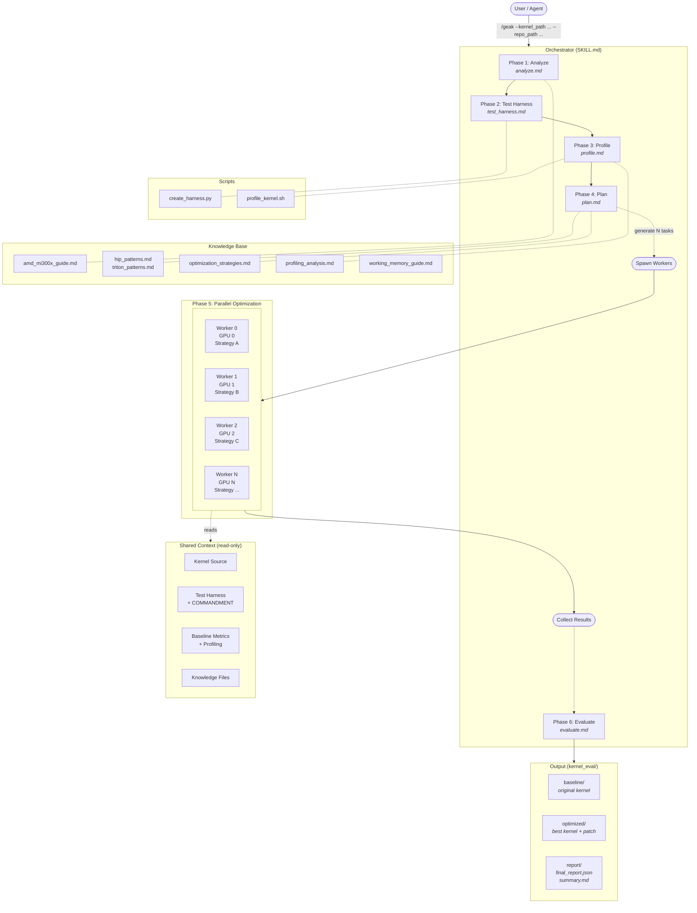
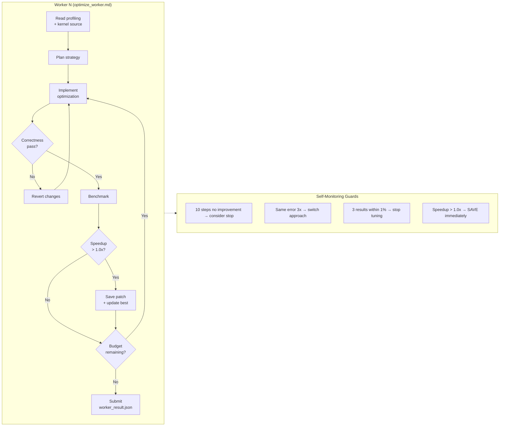

# PerfSkills

A collection of reusable skills for GPU kernel performance optimization. These skills encode expert-level optimization knowledge and workflows that can be consumed by any LLM-based coding agent.

## Available Skills

| Skill | Target Hardware | Description |
|-------|----------------|-------------|
| [GEAK](skills/geak/SKILL.md) | AMD MI300X (gfx942) | Autonomous GPU kernel optimization with parallel workers |

## GEAK: GPU Expert Agent for Kernel Optimization

GEAK is a 6-phase autonomous pipeline that analyzes, profiles, and optimizes GPU kernels (Triton or HIP) on AMD MI300X hardware. It spawns parallel optimization workers, each exploring a different strategy, and selects the best verified result.

### Architecture



#### Worker Lifecycle (Phase 5 Detail)

Each worker is an independent sub-agent running the 11-step workflow from `optimize_worker.md`:



### Features

- **Parallel optimization**: Multiple workers explore different strategies simultaneously, each on a dedicated GPU
- **Automatic profiling**: Bottleneck classification (memory-bound, compute-bound, latency-bound, LDS-bound) drives strategy selection
- **Multi-round iteration**: Up to N rounds of optimization, each building on the previous best result
- **Correctness verification**: Every optimization is validated against a reference before acceptance
- **Structured output**: Per-test-case results with geometric and arithmetic mean speedups

### Supported Kernel Types

| Type | Detection | Examples |
|------|-----------|---------|
| Triton | `.py` files with `@triton.jit` or `tl.` | Fused attention, custom GEMM, reduction kernels |
| HIP | `.hip`, `.cu`, `.cpp` files with `__global__` | Hand-written CUDA/HIP kernels, ported CUDA code |

## Prerequisites

- **Hardware**: AMD MI300X GPU (gfx942)
- **Software**:
  - ROCm 6.x
  - `hipcc` compiler
  - `rocprof-compute` (profiling)
  - Python 3.8+

## Usage

GEAK skills are agent-agnostic -- they provide structured optimization knowledge and workflows that any LLM-based coding agent can follow. Below are specific integration methods.

### GEAK Skills Mode (Claude Code)

The native integration with [Claude Code](https://docs.anthropic.com/en/docs/claude-code). Skills are loaded as slash commands with full tool access (Bash, Read, Write, Edit, Agent).

**Install:**

```bash
# Option A: Copy to project-local skills
mkdir -p .claude/skills
cp -r /path/to/PerfSkills/skills/geak .claude/skills/

# Option B: Symlink
ln -s /path/to/PerfSkills/skills/geak .claude/skills/geak
```

**Run:**

```
/geak --kernel_path /path/to/kernel.hip --repo_path /path/to/repo
```

With optional parameters:

```
/geak --kernel_path /path/to/kernel.py \
      --repo_path /path/to/repo \
      --num_parallel 4 \
      --gpu_ids 0,1,2,3 \
      --max_rounds 3
```

### Other Agents

The skills are plain Markdown files with structured instructions. To integrate with other agents:

1. **Feed `SKILL.md` as the system/orchestrator prompt** -- it defines the full 6-phase pipeline
2. **Load knowledge files on demand** -- `knowledge/*.md` provides domain expertise (hardware specs, optimization patterns, profiling interpretation)
3. **Use sub-skills as phase instructions** -- `sub_skills/*.md` contains step-by-step instructions for each phase
4. **Run scripts directly** -- `scripts/create_harness.py` and `scripts/profile_kernel.sh` are standalone tools

The agent needs the ability to: read/write files, execute shell commands, and (for Phase 5) spawn parallel sub-agents.

### Output

All outputs are saved under `./kernel_eval/<kernel_name>_<timestamp>/`:

```
kernel_eval/<kernel_name>_<YYYYMMDD_HHMMSS>/
├── baseline/           # Original kernel + baseline metrics
├── optimized/          # Best optimized kernel + patch
├── logs/               # Pipeline artifacts + per-worker logs
└── report/
    ├── final_report.json   # Machine-readable results
    └── summary.md          # Human-readable summary
```

## Benchmark

### Running the Evaluation

To reproduce the benchmark on your own kernel set:

1. **Prepare kernel tasks** -- each kernel in its own directory with source file and Makefile:
   ```
   kernel_tasks/
   ├── my_kernel_1/
   │   ├── my_kernel_1.hip
   │   └── Makefile
   ├── my_kernel_2/
   │   └── ...
   ```

2. **Run GEAK on each kernel** (example with Claude Code Skills Mode):
   ```
   cd kernel_tasks/my_kernel_1
   /geak --kernel_path $(pwd)/my_kernel_1.hip \
         --repo_path $(pwd) \
         --num_parallel 2 \
         --gpu_ids 0,1
   ```

3. **Collect results** from `kernel_eval/*/report/final_report.json`. Each report contains per-test-case speedups and aggregate metrics (geometric mean, arithmetic mean).

4. **Batch run** -- to optimize multiple kernels, launch one GEAK instance per kernel on separate GPUs:
   ```bash
   # Example: 13 kernels across 13 GPUs
   for i in $(seq 0 12); do
       kernel_dir=$(ls -d kernel_tasks/*/ | sed -n "$((i+1))p")
       kernel_file=$(find "$kernel_dir" -name "*.hip" | head -1)
       # Launch each on its own GPU pair
       /geak --kernel_path "$kernel_file" \
             --repo_path "$kernel_dir" \
             --gpu_ids "$((i*2)),$((i*2+1))"
   done
   ```

### Results

**GEAK Skills Mode vs GEAK_v3** on 13 HIP kernels (AMD MI300X): Skills Mode achieves **5.31x** arithmetic mean speedup vs GEAK_v3's **4.30x** (+23%), winning 9 out of 12 common kernels with zero failures.

Per-kernel breakdown and analysis: [examples/results/geak_skills_mode_vs_geak_v3.md](examples/results/geak_skills_mode_vs_geak_v3.md)

## Repository Structure

```
PerfSkills/
├── README.md
├── LICENSE
├── examples/
│   └── results/                       # Benchmark reports
│       └── geak_skills_mode_vs_geak_v3.md
├── skills/
│   └── geak/
│       ├── SKILL.md                   # Main orchestrator (6-phase pipeline)
│       ├── knowledge/                 # Domain knowledge base
│       │   ├── amd_mi300x_guide.md    # MI300X hardware reference
│       │   ├── hip_patterns.md        # HIP optimization patterns
│       │   ├── triton_patterns.md     # Triton optimization patterns
│       │   ├── optimization_strategies.md  # Per-bottleneck strategies
│       │   ├── profiling_analysis.md  # Profiling interpretation guide
│       │   └── working_memory_guide.md     # Worker self-monitoring
│       ├── scripts/                   # Tooling
│       │   ├── create_harness.py      # Test harness generator
│       │   └── profile_kernel.sh      # Profiling wrapper
│       └── sub_skills/                # Phase instructions
│           ├── analyze.md             # Phase 1: Kernel analysis
│           ├── test_harness.md        # Phase 2: Test setup
│           ├── profile.md             # Phase 3: Profiling
│           ├── plan.md               # Phase 4: Strategy planning
│           ├── optimize_worker.md     # Phase 5: Worker instructions
│           └── evaluate.md            # Phase 6: Result evaluation
```

## License

Apache License 2.0. See [LICENSE](LICENSE) for details.
