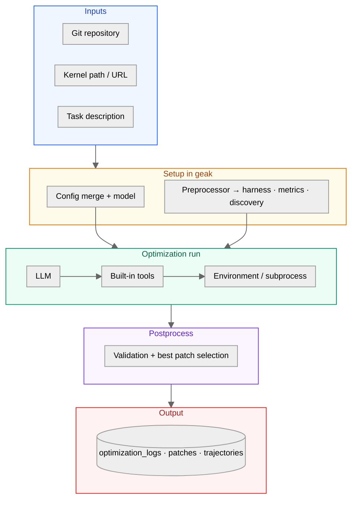

# GEAK

**For teams shipping GPU kernels in real repositories** — GEAK is an agent-driven framework that turns profiling, tests, and LLM reasoning into **reviewable patches**, from one file to repo-wide runs.

- **Stack-aware** — **HIP** and **Triton** are the primary optimization targets today; support for additional languages and stacks (including ASM, Gluon, and others) is on the roadmap.
- **Closed-loop / end-to-end** — **`geak`** can carry a run from start to finish: generate or discover **test/harness scripts** when needed, **run profiling**, iterate with the LLM, **save every patch** on disk, and **pick the best result** against your metrics—artifacts land for reproducibility.  
- **Scales with hardware** — Multi-agent parallel search with isolated git workspaces and best-patch selection when you explore competing strategies.

**Documentation:** Markdown under [`docs/`](docs/) — start with **[Quick start](docs/quick_start.md)** if you want to run `geak` immediately.

**Benchmark (AgentKernelArena):** test benchmark results on HIP and Triton kernels with GEAK — [AMD-AGI/AgentKernelArena: `agents/geak_v3`](https://github.com/AMD-AGI/AgentKernelArena/tree/geak_benchmark/agents/geak_v3).

## Architecture

Simplified data flow for a typical **`geak`** run:



## Quick Start

Minimal steps to install GEAK and run the **`geak`** CLI against a kernel or repository.

### Prerequisites

- **Python** 3.10+
- **Git** (parallel runs use worktrees)
- **GPU** and the stack your kernels use — e.g. **Triton**, **PyTorch**, **CUDA**, or compiled **HIP**.
- **AMD Instinct / Radeon (ROCm):** install a normal **ROCm** user-space environment so tools like **`rocminfo`** / **`rocm-smi`** work when the agent inspects hardware. For **HIP C++** you also need **`hipcc`** (and friends). **`HIP_VISIBLE_DEVICES`** is often set by the scheduler or your shell when pinning a card.

### Install

From the repository root:

```bash
git clone https://github.com/AMD-AGI/GEAK.git
cd GEAK

# Docker-based
AMD_LLM_API_KEY=<YOUR_KEY> bash scripts/run-docker.sh
# (or)
# Local
pip install -e .
```

### Model setup

```bash
# Set model name and key. In the case of docker-based setup, export the API key before
# running scripts/run-docker.sh.

# Option 1: set a LiteLLM model + provider API key
export MSWEA_MODEL_NAME="openai/gpt-5"
export OPENAI_API_KEY="YOUR_KEY"

# Anthropic example
export MSWEA_MODEL_NAME="anthropic/claude-sonnet-4-5-20250929"
export ANTHROPIC_API_KEY="YOUR_KEY"

# Option 2: If you use AMD LLM Gateway (model_class: amd_llm)
export AMD_LLM_API_KEY="YOUR_KEY"
```

- Full model/back-end configuration (and precedence rules) lives in [`docs/model_config.md`](docs/model_config.md).


## Configurations

GEAK is primarily configured via **CLI flags**, optionally merged with a **YAML config file**.

- **Config file location**: `src/minisweagent/config/*.yaml`. You can add your own config (e.g. `custom_config.yaml`) in this directory.
- **Config file merge**: pass `--config path/to/config.yaml` to apply it as the final override (overriding defaults such as `geak.yaml`).

### Most-used CLI flags

| Option | Required | What it controls |
|--------|----------|------------------|
| `-t`, `--task` | Yes | Task string. If it matches an existing file path, GEAK reads the file contents as the task body. |
| `--repo` | Yes | Repository root for the kernel. (Even single files should live in a repo for worktrees/patching.) |
| `--kernel-url` | Yes | Kernel source file (path or URL). |
| `--test-command` | No | Command to validate correctness and measure performance (if you have an existing harness). Prefer **relative paths** so worktree creation does not break your test harness paths. |
| `--num-parallel` | No | Number of parallel agent runs. |
| `--gpu-ids` | No | Comma-separated GPU device indices (one per parallel agent). |
| `-o`, `--output` | No | Trajectory file or output directory. Default: `./optimization_logs/<kernel>_<timestamp>/` |
| `-y`, `--yolo` | No | Non-interactive / auto-confirm tool execution (parallel workers already run in yolo mode). |
| `--exit-immediately` | No | Do not ask for confirmation before exit (useful for batch runs). |
| `-c`, `--config` | No | Path to a YAML config file (merged over `geak.yaml`). |

For more options and examples, see **[Configuration](docs/configuration.md)**

### Run GEAK

Single-agent run with explicit `--kernel-url` and `--repo`:
Note: `--kernel-url` accepts either a GitHub URL or a local file path.

```bash
geak --kernel-url /path/to/kernel/file \
  --repo /path/to/kernel/repo \
  --task "Optimize the kernel. Metric: higher is better."
```

Parallel agents (one agent per GPU ID):

```bash
geak --num-parallel 4 \
  --repo /path/to/kernel/repo \
  --kernel-url /path/to/kernel/file \
  --task "Optimize the kernel. Metric: Extract Bandwidth in GB/s (higher is better)" \
  --gpu-ids 0,1,2,3
```

Natural-language task (GEAK can parse targets from text when present):

```bash
geak -t "Optimize the kernel url at /path/to/repo/path/to/kernel.py. Repo path is /path/to/repo. Use GPUs 0-3."
```

### Runnable examples

These are **examples** you can test in `examples/`. Replace paths, GPU IDs, and the metric wording as needed.

**Example: HIP kernel `knn`**
```bash
# Repo root containing the kernel file
REPO="/path/to/GEAK/examples/knn"

geak --repo "$REPO" \
  --kernel-url "$REPO/knn_wrapper.py" \
  --test-command "python scripts/task_runner.py compile && python scripts/task_runner.py correctness && python scripts/task_runner.py performance" \
  --task "Optimize the knn kernel. Metric: latency (lower is better)." \
  --yolo --exit-immediately
```

**Example: Triton kernel `mla_decode`**

```bash
REPO="/path/to/GEAK/examples/mla_decode"

geak --repo "$REPO" \
  --kernel-url "$REPO/kernel.py" \
  --test-command "python3 -c \"import ast; ast.parse(open('kernel.py').read())\" && python3 'test_kernel_harness.py' --correctness && python3 'test_kernel_harness.py' --full-benchmark" \
  --task "Optimize the MLA decode Triton kernel." \
  --yolo --exit-immediately
```

### Output & Artifacts

GEAK saves patches + test logs so the optimization progress and the results are transparent.

- **Default output base**: `optimization_logs/`
- **Auto-generated run directory**: `optimization_logs/<kernel_name>_<YYYYmmdd_HHMMSS>/`

Typical structure (parallel run):

```bash
optimization_logs/<kernel>_<timestamp>/
├── parallel_0/
│   ├── patch_0.patch
│   ├── patch_0_test.txt
│   └── agent_0.log
├── parallel_1/
│   └── ...
├── best_results.json
└── select_agent.log
```

Structure for triton kernels:

```bash
optimization_logs/<kernel>_<timestamp>/
├── results/round_1/<kernel>-<strategy_0>/
│   ├── patch_0.patch
│   ├── patch_0_test.txt
│   └── task_0.log
├── results/round_1/<kernel>-<strategy_1>/
│   └── ...
├── best_results.json
└── select_agent.log
```

---

## Features


### Preprocess

Every **`geak`** run starts with **preprocessing**: the goal is to replace guesswork with **measured facts** (resolved paths, runnable commands, and baseline metrics) so the optimization loop is more reliable.

Preprocess typically performs:

- **Resolve inputs**: kernel URL/path, repo root, and output directory
- **Collect context**: lightweight codebase inspection relevant to the kernel
- **Lock in a harness**: discover or validate a correctness/perf entrypoint
- **Profile + baseline**: run the kernel to record the baseline metric used for all later comparisons


Key invariants:

- **Baseline is measured before optimization**: all reported speedups compare against the same frozen baseline (not a moving target).
- **Harness is fixed for the run**: the same entrypoints/modes are reused from preprocess through patch evaluation.

Harness discovery behavior:

- **If you pass `--test-command`**: preprocess uses it as the harness for correctness + performance checks.
- **If you do not pass `--test-command`**: preprocess may invoke **UnitTestAgent** to find an existing harness or materialize a validated one (correctness / profile / benchmark modes). The resulting command is then reused by the optimization loop.


### Best patch selection

Use **`--num-parallel`** to run multiple optimization agents concurrently and then automatically pick the best result.

- **Isolation**: each agent runs in its own git worktree (optionally pinned with **`--gpu-ids`**).
- **Selection**: after all agents finish, GEAK reads those artifacts and selects the best patch using your metric (from task text or **`patch.metric`** in YAML).
- **Outputs**: **`best_results.json`** and **`select_agent.log`** summarize the final choice.

---

## Summary

**GEAK v3** is built to **automatically optimize HIP and Triton GPU kernels end to end** in real repositories: **`geak`** drives the full loop—measurement, iteration, patch application, and validation—so you are not stitching shell steps by hand. Runs are **reproducible and auditable**: everything lands under **`optimization_logs/`**, and **parallel** mode adds isolated **worktrees** plus **best-patch selection** when you want broader search without sacrificing traceability.

## Contributing

We appreciate all contributions. If you are planning to contribute **bug fixes**, please do so without further discussion.

If you plan to contribute **new features, utility functions, or changes to the core**, please **open an issue first** and discuss the design with us. A pull request sent without that discussion may be **closed or not merged** if it diverges from the direction we are taking the project.

For branching, pull requests, code standards, CI expectations, releases, and licensing details, see **[Contribution guidelines](docs/developer/contribution_guidelines.md)**.

## Acknowledgments

GEAK extends **[mini-SWE-agent](https://github.com/SWE-agent/mini-SWE-agent)** — agent loop, environment tooling, and SWE-style workflows — for upstream behavior and APIs, see the **[mini-SWE-agent documentation](https://mini-swe-agent.com/latest/)**.

We also thank:

- **[LiteLLM](https://github.com/BerriAI/litellm)** — unified LLM routing used by model backends  
- **[Typer](https://github.com/tiangolo/typer)** & **[Rich](https://github.com/Textualize/rich)** — CLI and terminal UX  
- **[Model Context Protocol (MCP)](https://modelcontextprotocol.io/)** ecosystem (e.g. `mcp`, **FastMCP**) — tool servers for profiling, metrics, and discovery  
- **[LangChain](https://github.com/langchain-ai/langchain)** (optional `[langchain]` extra) — hybrid retrieval for the GPU knowledge path  
- **AMD Research [IntelliKit](https://github.com/AMDResearch/intellikit)** (`metrix`) — GPU profiling metrics integration  

Dependencies and versions are listed in `pyproject.toml`; all third-party software remains under their respective licenses.