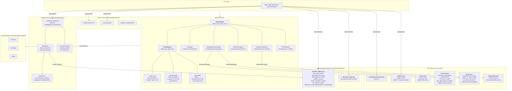

# GEAK — Repository Architecture

MCP servers, agent hierarchy, and how they connect.

```mermaid
graph TB
    subgraph CLI ["CLI Layer"]
        GEAK_CLI["geak / geak-preprocess / geak-orchestrate"]
    end

    subgraph AGENTS ["Agent Hierarchy"]
        DA["<b>DefaultAgent</b>\n<i>Base: bash, editor, tools</i>"]
        DA --- SIA["StrategyInteractiveAgent\n<i>Strategy-based optimisation</i>"]
        DA --- SWE["SweAgent\n<i>Code-level modifications</i>"]
        DA --- PA["<b>ParallelAgent</b>\n<i>Wraps any agent class</i>"]
        DA --- SPA["SelectPatchAgent\n<i>LLM best-patch selection</i>"]
        DA --- OEW["OpenEvolveWorker\n<i>OpenEvolve task execution</i>"]
        DA --- UTA["UnitTestAgent\n<i>Test discovery / creation</i>"]

        PA --- SINGLE["single mode\n(num_parallel=1)\n1 agent + patch save"]
        PA --- PARALLEL["parallel mode\n(num_parallel>1)\nN agents on N GPUs\ngit worktrees"]
        PA --- POOL["pool mode\n(tasks=…)\nheterogeneous tasks\nacross GPU pool"]
    end

    subgraph MCP ["MCP Servers (mcp_tools/)"]
        MCP_ATD["<b>automated-test-discovery</b>\ndiscover"]
        MCP_PROF["<b>profiler-mcp</b>\nprofile_kernel\n(Metrix + rocprof-compute)"]
        MCP_METRIX["<b>metrix-mcp</b>\nprofile_kernel\n(AMD Metrix only)"]
        MCP_KE["<b>kernel-evolve</b>\ngenerate_optimization\nmutate_kernel\ncrossover_kernels\nget_optimization_strategies\nsuggest_kernel_params"]
        MCP_ERCS["<b>kernel-ercs</b>\nevaluate_kernel_quality\nreflect_on_kernel_result\nget_amd_gpu_specs\ncheck_kernel_compatibility"]
        MCP_OE["<b>openevolve-mcp</b>\noptimize_kernel\ncheck_openevolve_status"]
    end

    subgraph BUILTIN ["Built-in Tools (src/minisweagent/tools/)"]
        T_RKU["resolve_kernel_url"]
        T_CMD["commandment"]
        T_VCMD["validate_commandment"]
    end

    subgraph SHARED ["Shared Pipeline Helpers (src/minisweagent/run/)"]
        PH["<b>pipeline_helpers.py</b>\nload_geak_model\nadd_agent_filter_args\ninject_pipeline_context\nvalidate_harness\ncreate_validated_harness\nrun_baseline_profile\nDEFAULT_EVAL_BENCHMARK_ITERATIONS"]
        DT["<b>discovery_types.py</b>\nDiscoveryResult.from_dict()"]
    end

    subgraph CTXPASS ["Context Passing (src/minisweagent/run/)"]
        CTX_GEN["codebase_context.py\ngenerate CODEBASE_CONTEXT.md"]
        CTX_DISP["dispatch.py\ninject context into\nsub-agent prompts"]
        CTX_TG["task_generator.py\ncontext available\nto LLM planner"]
        CTX_TR["ToolRuntime\nset_codebase_context()\npropagate to SubAgentTool"]
        CTX_GEN --> CTX_DISP --> CTX_TR
        CTX_GEN --> CTX_TG
    end

    subgraph MODELS ["LLM Backends (src/minisweagent/models/)"]
        M_AMD["amd_llm"]
        M_ANTH["anthropic"]
        M_LITE["litellm"]
    end

    CLI --> AGENTS
    GEAK_CLI -->|"preprocessor"| MCP_ATD & MCP_PROF & T_RKU & T_CMD & CTX_GEN
    GEAK_CLI -->|"shared helpers"| PH & DT
    CTX_DISP -->|"context injection"| PH
    SIA -->|"during optimisation"| MCP_KE & MCP_ERCS
    OEW -->|"evolutionary search"| MCP_OE
    AGENTS -->|"LLM inference"| MODELS
```
