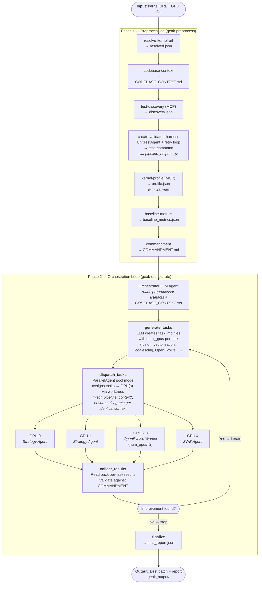

# GEAK — End-to-End Optimization Flow

```mermaid
flowchart TB
    START(["<b>Input:</b> kernel URL + GPU IDs"]) --> P1

    subgraph PREPROCESS ["Phase 1 — Preprocessing (geak-preprocess)"]
        direction TB
        P1["resolve-kernel-url\n→ resolved.json"]
        P1b["codebase-context\n→ CODEBASE_CONTEXT.md"]
        P2["test-discovery (MCP)\n→ discovery.json"]
        P2b["create-validated-harness\n(UnitTestAgent + retry loop)\n→ test_command\n<i>via pipeline_helpers.py</i>"]
        P3["kernel-profile (MCP)\n→ profile.json\n<i>with warmup</i>"]
        P4["baseline-metrics\n→ baseline_metrics.json"]
        P5["commandment\n→ COMMANDMENT.md"]
        P1 --> P1b --> P2 --> P2b --> P3 --> P4 --> P5
    end

    P5 --> ORCH_START

    subgraph ORCH ["Phase 2 — Orchestration Loop (geak-orchestrate)"]
        direction TB
        ORCH_START["Orchestrator LLM Agent\n<i>reads preprocessor artefacts +\nCODEBASE_CONTEXT.md</i>"]
        GEN["<b>generate_tasks</b>\nLLM creates task .md files\nwith num_gpus per task\n(fusion, vectorisation, coalescing, OpenEvolve …)"]
        DISPATCH["<b>dispatch_tasks</b>\nParallelAgent pool mode\nassigns tasks → GPU(s) via worktrees\n<i>inject_pipeline_context()\nensures all agents get identical context</i>"]
        ORCH_START --> GEN --> DISPATCH

        DISPATCH --> GPU0["GPU 0\n<i>Strategy Agent</i>"]
        DISPATCH --> GPU1["GPU 1\n<i>Strategy Agent</i>"]
        DISPATCH --> GPU23["GPU 2,3\n<i>OpenEvolve Worker</i>\n(num_gpus=2)"]
        DISPATCH --> GPU4["GPU 4\n<i>SWE Agent</i>"]

        COLLECT["<b>collect_results</b>\nRead back per-task results\nValidate against COMMANDMENT"]
        GPU0 & GPU1 & GPU23 & GPU4 --> COLLECT

        DECIDE{{"Improvement found?"}}
        COLLECT --> DECIDE
        DECIDE -->|"Yes → iterate"| GEN
        DECIDE -->|"No → stop"| FINAL["<b>finalize</b>\n→ final_report.json"]
    end

    FINAL --> RESULT(["<b>Output:</b> Best patch + report\ngeak_output/"])
```
