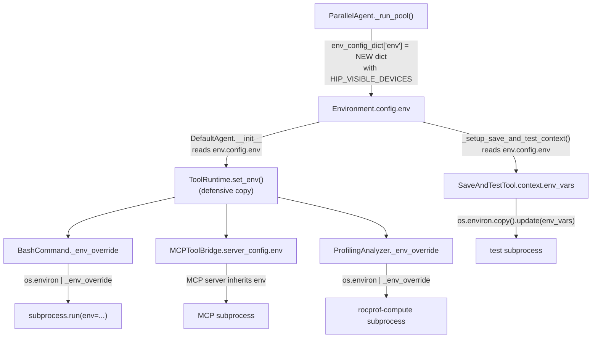

# GPU Isolation -- Developer Guide

How `HIP_VISIBLE_DEVICES` flows from the orchestrator to every subprocess,
and what you must do when adding a new tool.

## HIP_VISIBLE_DEVICES Propagation

> For the overall component architecture (agents, MCP servers, tools), see [architecture.md](architecture.md).
> The diagram below focuses specifically on how `HIP_VISIBLE_DEVICES` reaches each subprocess.



**Key files in the chain:**

| Step | File | What happens |
|------|------|-------------|
| 1 | `parallel_agent.py` `_run_pool()` | Creates a **new** `env` dict per thread with `HIP_VISIBLE_DEVICES` set to the acquired GPU(s). |
| 2 | `environments/local.py` | `LocalEnvironmentConfig.env` stores the dict. |
| 3 | `agents/default.py` `__init__` | Reads `env.config.env` and calls `toolruntime.set_env()`. |
| 4 | `tools/tools_runtime.py` `set_env()` | Defensive-copies the dict, then sets `_env_override` on `BashCommand`, `ProfilingAnalyzer`, and calls `bridge.set_env()` on every `MCPToolBridge`. |
| 5 | Individual tools | Each tool merges `_env_override` into `os.environ` when spawning subprocesses. |

## Other Environment Variables Using This Path

`GEAK_BENCHMARK_EXTRA_ARGS` (default: `--iterations 50`) follows the same
propagation chain as `HIP_VISIBLE_DEVICES`.  It is set in:

- `dispatch.py` `run_task_batch()` — `base_env_vars` for agents in pool mode.
- `mini.py` `main()` — `config["env"]["env"]` for agents in `geak --from-task`.
- `orchestrator.py` `_build_eval_env()` — for COMMANDMENT-based evaluation.

This ensures all benchmark invocations (agent-time and evaluation-time) use
the same iteration count.  The COMMANDMENT BENCHMARK / FULL_BENCHMARK
sections expand `${GEAK_BENCHMARK_EXTRA_ARGS:-}`, and `run_harness._run_single`
reads it from the subprocess env for direct harness invocations.

## Invariants

Rules that must always hold for correct GPU isolation:

1. **No GPU-touching tool may call `subprocess.run` without an explicit `env=`
   that includes the agent's `HIP_VISIBLE_DEVICES`.**
   The only exception is tools that never use the GPU (e.g. `str_replace_editor`).

2. **Never mutate `os.environ` in library code.**
   Only standalone CLI entrypoints (single-process, single-agent) may write
   `os.environ["HIP_VISIBLE_DEVICES"]`. Library code used by parallel agents
   must use `env.config.env` and `set_env()`.

3. **Never share a mutable `env` dict across threads.**
   Always create a new dict (`dict(...)` or `{**old, ...}`) when building
   per-agent environments in parallel code paths. A shallow copy of a
   dataclass `__dict__` shares nested dicts -- this was the root cause of
   the shallow-copy race bug in `parallel_agent.py`.

4. **`ToolRuntime.set_env` is the single point of propagation.**
   Any new tool that runs subprocesses must be wired into this method.

5. **MCP servers are per-agent.**
   Each agent creates its own `ToolRuntime` with its own `MCPToolBridge`
   instances. The bridge's `set_env` must be called before the first tool
   invocation (it injects env into `server_config` before the server starts).

## How to Add a GPU-Aware Tool

Checklist for any new tool that spawns subprocesses:

1. Add `self._env_override: dict[str, str] = {}` to the tool's `__init__`.

2. In every `subprocess.run` call, pass:
   ```python
   env = os.environ | self._env_override if self._env_override else None
   subprocess.run(cmd, ..., env=env)
   ```

3. In `ToolRuntime.set_env`, add:
   ```python
   my_tool = self._tool_table.get("my_tool_name")
   if my_tool is not None:
       my_tool._env_override = env
   ```

4. If the tool is an **MCP bridge**, `MCPToolBridge.set_env` already handles
   propagation -- no extra wiring needed.

5. **Test**: run `geak --gpu-ids 0,1` with 2+ tasks and inspect
   `/proc/<pid>/environ` for each subprocess to verify `HIP_VISIBLE_DEVICES`
   is set correctly (see verification commands below).

## Known Pitfalls and Past Bugs

### Shallow copy race (fixed)

`base_env.config.__dict__.copy()` is a shallow copy. The nested `env` dict
was shared across all threads in `_run_pool`, so the last thread to write
`HIP_VISIBLE_DEVICES` won for every agent.

**Fix**: always create a new dict:
```python
env_config_dict["env"] = {**(env_config_dict.get("env") or {}), "HIP_VISIBLE_DEVICES": hip_devices}
```

### Empty dict is falsy

`BashCommand` uses `if self._env_override` as a guard. An empty `{}` is
falsy and falls through to `env=None` (inheriting `os.environ`). This is
correct: if no override is set, the tool uses the default env. But calling
`set_env({})` effectively disables the override -- only call it with a
non-empty dict.

### Docker ENV persistence

`ENV HIP_VISIBLE_DEVICES=0` in a Dockerfile persists across `docker exec`
and cannot be unset by child processes. The container's `entrypoint.sh`
must `unset HIP_VISIBLE_DEVICES` so that `geak --gpu-ids` controls
isolation, not a stale Dockerfile default.

### run_openevolve.py env override

The geak-oe script (`run_openevolve.py`) unconditionally sets
`os.environ["HIP_VISIBLE_DEVICES"]` and `os.environ["GEAK_GPU_IDS"]`.
It has been patched to check `if key not in os.environ` first. If this
patch is lost on a container rebuild, OpenEvolve tasks will use all
physical GPUs instead of only their assigned subset.

The MCP server (`openevolve-mcp`) pre-sets both env vars before spawning
`run_openevolve.py`, so the patched conditional preserves them.

## Container-Level GPU Restriction

When running GEAK inside a Docker container restricted to a subset of
physical GPUs (e.g. `docker run -e HIP_VISIBLE_DEVICES=2,4,6,7 ...`),
HIP remaps them to container-local IDs 0, 1, 2, 3.

The `--gpu-ids` flag always refers to **container-local** IDs, not
physical IDs:

- `--gpu-ids 0,1,2,3` inside the container maps to physical GPUs 2,4,6,7.
- The code never assumes physical GPU IDs -- it only uses whatever IDs
  the user passes.
- `rocm-smi` inside the container reports only the visible GPUs (0-3).
- `_detect_available_gpus()` in `run_openevolve.py` respects container
  boundaries (rocm-smi only sees remapped devices).

Example:

```bash
# Host: restrict container to physical GPUs 2, 4, 6, 7
docker run -e HIP_VISIBLE_DEVICES=2,4,6,7 ...

# Inside container: use container-local IDs
geak --kernel-url ... --gpu-ids 0,1,2,3
```

## Quick Verification

Check GPU assignment of all agent subprocesses inside the container:

```bash
for pid in $(ps aux | grep python | grep -v grep | awk '{print $2}'); do
  cmd=$(cat /proc/$pid/cmdline 2>/dev/null | tr '\0' ' ' | head -c 120)
  if echo "$cmd" | grep -qE 'slot_|_mcp\.'; then
    hip=$(cat /proc/$pid/environ 2>/dev/null | tr '\0' '\n' | grep '^HIP_VISIBLE_DEVICES=')
    echo "PID $pid | $hip | $cmd"
  fi
done
```

Check actual GPU utilization:

```bash
rocm-smi --showuse
```
