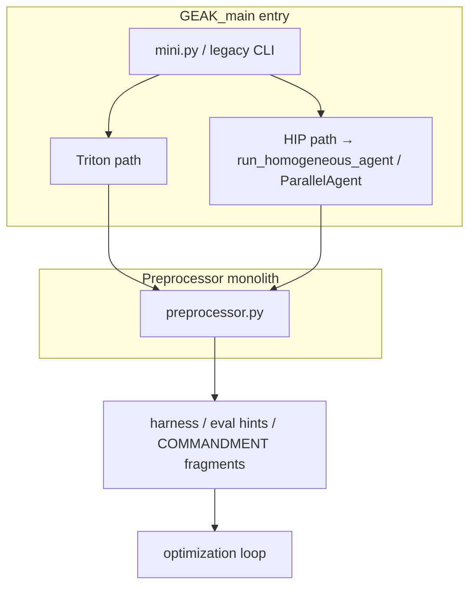
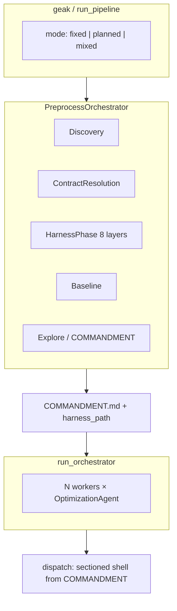

# GEAK refactor — onboarding context (HIP, pipeline, components)

This document collects **architecture, workflow, and operational context** for someone new picking up the **refactor branch** of GEAK (`mini-swe-agent` package, CLI entry **`geak`**). It reflects the intended design as of the preprocess refactor (phased orchestrator, universal harness contract, COMMANDMENT-driven evaluation).

**Scope:** Refactor tree (e.g. `/data/sapmajum/GEAK`, branch such as `refactor-test`). **`GEAK_main`** is a separate checkout; it may still use older entry points (e.g. `mini.py` routing HIP through `run_homogeneous_agent`). For **strict CLI parity** with the unified design, work from the refactor repo and the `geak` entry point.

---

## 1. Which codebase is “the product path”?

| Item | Location / role |
|------|-----------------|
| **Unified CLI** | `geak` → `minisweagent.cli:cli_entry` (see `pyproject.toml` `[project.scripts]`) |
| **Pipeline core** | `minisweagent.run.unified` — `run_pipeline` for `fixed` / `planned` / `mixed` modes |
| **Preprocess** | `minisweagent.run.preprocess.orchestrator` — `PreprocessOrchestrator` + `run_preprocessor_via_orchestrator` |
| **Optimization loop** | `minisweagent.run.orchestrator` — `run_orchestrator` / `run_planned_orchestrator` after preprocess |
| **Task dispatch** | `minisweagent.run.dispatch` — reads `COMMANDMENT.md` sections, builds eval shell from frozen contract |
| **Harness contract (spec)** | `minisweagent.kernel_languages.contract` |
| **Harness validation (static + runtime)** | `minisweagent.run.preprocess.harness_utils` — `validate_harness`, `execute_harness_validation` |
| **Shell → contract adapter (deterministic)** | `minisweagent.run.preprocess.eval_contract_adapter` |
| **LLM harness synthesis** | `minisweagent.subagents.preprocess.harness_builder` — `HarnessBuilder` |

**Documentation pointers:** `docs/refactor/EXECUTION_PLAN.md` (validators, milestones). This file is a **narrative onboarding** supplement.

---

## 2. How HIP kernels are usually run (repo-centric picture)

HIP workloads in benchmarks (e.g. **AgentKernelArena**) almost never expose “just run one `.hip` file.” The repo provides a **single evaluation driver**—often:

```bash
python3 scripts/task_runner.py compile
python3 scripts/task_runner.py correctness
python3 scripts/task_runner.py performance
```

or one chained shell line:

```bash
python3 scripts/task_runner.py compile && python3 scripts/task_runner.py correctness && python3 scripts/task_runner.py performance
```

**What GEAK needs from that:** a **repo root**, a **kernel file path** (or URL to clone), and either:

- **`correctness_command` + `performance_command`**, or
- a single **`eval_command`** that can be split (see §5.2), or
- discovery + LLM harness generation when nothing is explicit.

The **universal harness contract** (§3) is language-agnostic at the **outer** surface: a Python file with argparse modes and stdout markers. **Inside** the harness, HIP may call `hipcc`, `make`, or `task_runner`—that is the “kernel language / repo” concern.

**Container / GPU note:** On shared hosts, ROCm jobs often run in Docker (e.g. `geak_slot1`, `geak_slot2`) with `/dev/kfd` and `/dev/dri` passed through. **Pinning** which physical GPU a container uses is done with **`ROCR_VISIBLE_DEVICES` / `HIP_VISIBLE_DEVICES`** (or equivalent) on **`docker run`**—not automatically enforced by empty env inside the container. Multiple containers can contend for the same GPUs unless isolation is configured at the orchestration layer.

---

## 3. Universal harness contract (outer surface)

Specified in `kernel_languages/contract.py` and enforced in practice by `harness_utils.validate_harness` (static) + `run_harness` / `execute_harness_validation` (runtime).

**CLI (mutually exclusive):**

- `--correctness` — print `OK` or `FAIL`
- `--profile` — run profile path; must still participate in the contract pipeline
- `--benchmark` — print `GEAK_RESULT_LATENCY_MS=<float>`
- `--full-benchmark` — print `GEAK_RESULT_LATENCY_MS=...` and `GEAK_RESULT_SPEEDUP=<float>`

**Why it exists:** downstream **dispatch** and **metrics** assume one stable interface so Triton, HIP, CUDA, etc. can share the same orchestration, COMMANDMENT structure, and tests.

---

## 4. Preprocess pipeline — `PreprocessOrchestrator` (phase order)

Source: `run/preprocess/orchestrator.py` — `PreprocessOrchestrator` default phase list.

| # | Phase | Role (high level) |
|---|--------|-------------------|
| 1 | **TranslationPhase** | Conditional: only if translating source → target language before optimization. |
| 2 | **DiscoveryPhase** | Automated test discovery (ATD), repo recon, `resolved.json` / `discovery.json` style inputs, kernel path and language hints. |
| 3 | **ContractResolutionPhase** | Freezes / normalizes the **evaluation contract** on `PhaseContext` (e.g. `evaluation_contract`) so later phases share one SSOT. |
| 4 | **HarnessPhase** | Produces a **validated** `harness_path` and `test_command` (see §5). |
| 5 | **BaselinePhase** | Baseline metrics / artifacts for comparison (e.g. `baseline_metrics.json` when run). |
| 6 | **ExplorePhase** | COMMANDMENT generation / exploration (Jinja, kernel analysis wiring, etc.). |

**Early exit:** If `GEAK_HARNESS_ONLY=1`, the orchestrator returns **after HarnessPhase** (skips baseline + explore). Used for fast harness-only validation tests.

**Legacy fallback (transition):** The orchestrator docstring describes a **transitional** path: if mandatory outputs are still empty, code may fall back to the monolithic `run_preprocessor` for missing steps. New work should **prefer** filling `harness_path` / contract fields through phases; the **shell eval adapter** (§5.2) exists specifically to avoid “skip HarnessBuilder and merge only legacy” for `task_runner`-style eval.

---

## 5. HarnessPhase — eight layers (first success wins)

Source: `run/preprocess/phases/harness.py` module docstring and `HarnessPhase.run` layer list.

| Layer | Name | What it does |
|-------|------|----------------|
| 1 | `already_set` | `ctx.harness_path` was already populated upstream. |
| 2 | `explicit_harness` | User provided `--harness` / `ctx.harness`. Full static + runtime validation; on failure, path may be kept as **`ctx.harness_seed`** for HarnessBuilder. |
| 3 | `split_hint` | Discovery gave `split_harness_hint` (merged kernel split). |
| 4 | `testcase_cache` | Reuse a **canonical cached harness** for this kernel URL/path if manifest matches (see `GEAK_TESTCASE_CACHE_DIR`). |
| 5 | **`shell_eval_adapter`** | **Deterministic:** materializes `_geak_shell_contract_harness.py` via `eval_contract_adapter.materialize_shell_contract_harness`, wrapping repo shell commands into the universal contract **without LLM**. Needs **both** correctness and performance shell strings (from `correctness_command` + `performance_command`, or **`eval_command` split on the last `&&`**). |
| 6 | **`harness_builder`** | **LLM subagent:** `HarnessBuilder` + language Jinja template + retry budget (`GEAK_HARNESS_BUILDER_BUDGET_S`, default 1800 s). Use when discovery/prompt/repo layout is **variable** and no explicit shell split exists. |
| 7 | `unit_test_agent` | Legacy UnitTestAgent path + optional shape-fixer. |
| 8 | `discovery_fallback` | Last resort: discovery `focused_test` / first test command — **may not** satisfy full universal contract. |

**Important distinction:**

- **Layer 5 (shell adapter)** = **no LLM**, fast path when Explore/COMMANDMENT already resolved **explicit shell** (`compile && correctness && …`).
- **Layer 6 (HarnessBuilder)** = **iterative LLM** path for **open-ended** “how do we bench this repo?” variance across languages and layouts.

After success, results are written to `ctx.harness_path`, `ctx.test_command`, `ctx.harness_results`, and optionally cached for Layer 4 next time.

---

## 5.1 `eval_contract_adapter` — command resolution rules

Source: `run/preprocess/eval_contract_adapter.py`.

- If **`correctness_command` and `performance_command`** are both set (string or list joined with ` && `), those strings are used.
- Else, if **`eval_command`** is a string containing **`&&`**, it is split with **`rsplit("&&", 1)`** into **(left, right)** → correctness side / performance side. **Caveat:** multiple `&&` in one line may not split the way you expect; prefer explicit **correctness + performance** fields in metadata when the graph is not a single two-part split.

The generated harness sets `cwd` to **resolved `repo_root`** and runs the repo’s own commands with `subprocess` / `shell=True` as appropriate.

---

## 6. After preprocess: COMMANDMENT and dispatch

**`COMMANDMENT.md`** is the human- and machine-readable **shell contract** for the run: sections `## Setup`, `## Correctness`, `## Benchmark`, `## Full Benchmark`, `## Profile` (see `kernel_languages/contract.py`).

**`minisweagent.run.dispatch`** reads those sections and builds the actual eval / benchmark shell the workers run, with normalization so section titles match both title-case and `UPPER_SNAKE` styles.

**Worker truth:** the optimization loop does not re-guess the test command from the prompt each time; it uses the **materialized COMMANDMENT + harness path** from preprocess when present.

---

## 7. Unified `run_pipeline` — modes (not “HIP vs Triton” branches)

Source: `run/unified.py` module docstring.

- **`fixed`** — “one task body × N workers” (same strategy, best-of-N on N GPUs). Former **homogeneous** mental model; same `OptimizationAgent` class.
- **`planned`** — planner emits **N distinct** strategy bodies. Former **heterogeneous** mental model; same agent class.
- **`mixed`** — split between the two styles when CLI default applies.

**All languages** that `geak` supports are intended to use this **one** stack: preprocess → COMMANDMENT → `run_orchestrator` → multi-round loop. There is **no** separate “HIP only uses ParallelAgent” path in the **refactor** design; `GEAK_main`’s `mini.py` may still be on the old branch until ported.

**Translation** is **not** a `run_pipeline` mode; it is the **TranslationPhase** preprocess step when changing source language to target.

---

## 8. Environment variables (non-exhaustive, practical)

| Variable | Purpose |
|----------|---------|
| `GEAK_HARNESS_ONLY=1` | Stop preprocess after HarnessPhase (harness + validation only). |
| `GEAK_TESTCASE_CACHE_DIR` | Optional directory for Layer 4 testcase cache (see `testcase_cache.py`). |
| `GEAK_HARNESS_BUILDER_BUDGET_S` | Wall time for HarnessBuilder retry loop (default 1800). |
| `GEAK_MODEL` / `GEAK_MODEL_ENSEMBLE` | Model selection (see `dispatch.py`, `unified.py` patterns). |
| `GEAK_BENCHMARK_ITERATIONS` / `GEAK_EVAL_BENCHMARK_ITERATIONS` | Iteration counts for eval (see `harness_utils.py` defaults). |

Use project `config/geak.yaml` and CLI flags for the full set in your tree.

---

## 9. How to run tests (refactor)

From repo root, with package on `PYTHONPATH`:

```bash
cd /data/sapmajum/GEAK   # your clone
PYTHONPATH=src python3 -m pytest tests/run/ tests/subagents/test_harness_builder.py tests/refactor_smoke/ -q
```

Targeted areas: `tests/run/test_preprocess_phases.py`, `test_preprocess_i1_capabilities.py`, `test_harness_phase_layer4.py`, `test_harness_variance.py`.

**Note:** Full `tests/models/` may require compatible `litellm` / `openai` versions; gate CI on the subset above if the model stack is not installed.

---

## 10. Parity / E2E scripts (if present in your tree)

Your environment may include ad-hoc runners under paths like `parity_test/ABvsMain/` (phased Triton→HIP, continuous monitors, manifests). These are **orchestration wrappers** around `geak` and Docker slots—not part of the core package. Treat them as **local automation**: read the shell headers before running, and avoid starting long `nohup` jobs on shared machines without GPU isolation.

---

## 11. Single-page mental model

1. **Discover** the repo and kernel; record how to build, test, and bench (ATD, COMMANDMENT inputs, or explicit `eval_command`).
2. **Normalize** the evaluation contract (`ContractResolutionPhase`).
3. **Materialize a universal harness** (cache, user path, **shell adapter**, or **HarnessBuilder**).
4. **Profile / baseline / explore** as applicable; emit **`COMMANDMENT.md`**.
5. **Optimize** in `fixed` / `planned` / `mixed` with **`run_orchestrator`**, using **dispatch** to run the sectioned shell against the harness.

HIP is just one **KernelLanguage**; the **outer** contract is shared, the **inner** commands stay repo-specific (`task_runner`, `hipcc`, `make`, etc.).

---

## 12. Where to edit what

| Concern | Primary files |
|---------|----------------|
| Phase order / orchestrator | `run/preprocess/orchestrator.py` |
| Harness layer behavior | `run/preprocess/phases/harness.py` |
| Deterministic shell wrapper | `run/preprocess/eval_contract_adapter.py` |
| Static/runtime harness checks | `run/preprocess/harness_utils.py`, `run/preprocess/run_harness.py` |
| COMMANDMENT structure | `kernel_languages/contract.py`, `run/preprocess/phases/explore.py`, commandment generators under `run/preprocess/` |
| CLI / entry | `minisweagent/cli.py`, `run/unified.py` |
| LLM harness builder | `subagents/preprocess/harness_builder.py`, Jinja under kernel language packages |

---

## 13. Main vs refactor — how parity runs were driven (exact mechanics)

This section documents the **automation under** `/data/sapmajum/parity_test/ABvsMain/` (host paths as used on the parity machine). Inside Docker, `geak_slot1` / `geak_slot2` mount the GEAK trees from `/data/sapmajum/`.

### 13.1 Containers and repos

| Slot | Container (example) | Working tree | Role |
|------|---------------------|--------------|------|
| “Main” | `geak_slot1` | **`cd /data/sapmajum/GEAK_main`** | Legacy **`GEAK_main`** CLI (`mini.py` may still route HIP differently — see §7). |
| “Refactor” | `geak_slot2` | **`cd /data/sapmajum/GEAK`** | Unified **`geak`** / `run_pipeline` preprocess stack. |

**Important:** The parity shell splits GPU hints **by convention**: **main** prompts append “Use GPUs **0–3**”; **refactor** prompts append “Use GPUs **4–7**”. That only helps **if** each container’s ROCm visibility matches that intent (`ROCR_VISIBLE_DEVICES` / host pinning). On a busy shared host, treat this as **documentation of intent**, not a guarantee of isolation.

### 13.2 Single-kernel A/B — `parity_launch_one_kernel.sh`

After sourcing `scripts/parity_geak_prompt.sh`, each row calls **`parity_run_kernel_pair NAME LANG K H`**:

1. Builds **`PROMPT`** via **`parity_geak_task_prompt`** (Triton vs HIP — see §13.4).
2. Appends output dirs:
   - Main: `"Use GPUs 0-3. The output directory should be ${MAIN_OUT}/out."` with `MAIN_OUT="$BATCH_DIR/${NAME}_main"`.
   - Refactor: `"Use GPUs 4-7. The output directory should be ${REF_OUT}/out."` with `REF_OUT="$BATCH_DIR/${NAME}_refactor"`.
3. Launches **both** in the background:

```bash
docker exec -d -e "GEAK_MAX_ROUNDS=$mr" -e "GEAK_MODEL=$gm" geak_slot1 bash -c \
  "cd /data/sapmajum/GEAK_main && geak -t '<full_main_prompt>' > '${MAIN_OUT}/run.log' 2>&1"
docker exec -d -e "GEAK_MAX_ROUNDS=$mr" -e "GEAK_MODEL=$gm" geak_slot2 bash -c \
  "cd /data/sapmajum/GEAK && geak -t '<full_ref_prompt>' > '${REF_OUT}/run.log' 2>&1"
```

4. Polls until **`$MAIN_OUT/out/final_report.json`** and **`$REF_OUT/out/final_report.json`** exist (interval **`MONITOR_POLL_SEC`**, default **600** s).
5. Optional **`RESULTS_CSV`**: appends speedups grep’d from `run.log` and totals from `final_report.json`.

**Refactor-only variant:** **`parity_run_kernel_refactor_only`** — same prompt builder, **one** `docker exec` to **`PARITY_REFACTOR_CONTAINER`** (default `geak_slot2`), **`PARITY_REFACTOR_GPU_HINT`** (default “Use GPUs 0-3.”), **`PARITY_REFACTOR_GEAK_CD`** (default `cd /data/sapmajum/GEAK`). Used by `run_parity_hip_manifest_refactor_only.sh`.

### 13.3 Phased Triton + HIP batch — `run_parity_phased_triton_then_hip.sh`

Location: `ABvsMain/scripts/run_parity_phased_triton_then_hip.sh`.

**Preview (default):** clone AgentKernelArena → stage tasks → write **`GEAK_PREVIEW.md`** / JSON → exit.

```bash
cd /data/sapmajum/parity_test/ABvsMain/scripts
./run_parity_phased_triton_then_hip.sh
# or explicitly:
./run_parity_phased_triton_then_hip.sh --preview
# Optional: BATCH_DIR=/path/to/batch ./run_parity_phased_triton_then_hip.sh
```

**Execute** (manifest-driven A/B per kernel):

```bash
PARITY_MANIFEST=/path/to/manifest.tsv \
RESULTS_CSV=/path/to/results.csv \
GEAK_MAX_ROUNDS=5 GEAK_MODEL=claude-opus-4.6 \
./run_parity_phased_triton_then_hip.sh --execute /path/to/batch_dir
```

Requires **`batch_dir/staged/manifest.tsv`** and cloned **`batch_dir/source/AgentKernelArena`**. Ends with **`collect_parity_batch_logs.sh`** and prints **`results.csv`**.

**HIP-only manifest reruns** (same execute pattern, custom manifest): e.g. `parity_hip_only_20260427_022936/manifest_hip_only.tsv` under `ABvsMain/`.

### 13.4 Prompt text — `parity_geak_prompt.sh` (Triton vs HIP)

**Triton** (`LANG=triton`): kernel path **`K`**, harness **`H`** — **planned** mode sentence:

> Optimize the Triton kernel at `${K}. Use the test harness at ${H}.` … **Pipeline mode: planned** …

**HIP** (`LANG=hip`): **`K`** = **repo root**, **`H`** = sentinel:

| Sentinel | Eval shell baked into prompt |
|----------|-------------------------------|
| `SILU_TASKRUNNER` / `MATMUL_TASKRUNNER` / `STANDARD_HIP_TASKRUNNER` | `python3 scripts/task_runner.py compile && … correctness && … performance` |
| `GPUMODE_EVAL` | `eval_tools/compile.py` / `correctness_check.py` / `cal_kernel_perf.py` |

HIP uses **fixed** mode (same task body × N workers). The script discovers a concrete **`.hip`** file under **`K`** with `ls`/`find`.

### 13.5 In-repo Python parity (container `geak_agent`, harness-only preprocess)

**Script:** `GEAK/scripts/parity/parity_test_e2e.py` (in refactor tree).

- Compares **`refactor-test`** repo root **`/data/sapmajum/GEAK`** vs **`origin-main`** checkout **`/data/sapmajum/parity_test/GEAK-main`**.
- Runs **`docker exec geak_agent bash -c`** with env **`GEAK_USE_KERNEL_ANALYSIS=0`**, optional **`GEAK_HARNESS_ONLY=1`**, then:

```text
pip install -e . && \
GEAK_USE_KERNEL_ANALYSIS=0 GEAK_USE_KNOWLEDGE_BASE=0 GEAK_SAVE_TO_KNOWLEDGE_BASE=0 [GEAK_HARNESS_ONLY=1] \
python -m minisweagent.cli 'optimize <kernel_path> with max_rounds=1 gpu_ids=0' --output-dir <output_dir>
```

Use **`python scripts/parity/parity_test_e2e.py --kernels …`** from the GEAK clone for full parity (see script header). This path stresses **preprocess artefacts** (harness, COMMANDMENT sections, baseline keys, profile JSON), not full multi-round optimization.

---

## 14. Pipeline diagrams — “before” (main) vs “after” (refactor intent)

### 14.1 Legacy mental model (GEAK_main / `mini.py` era)



**Pain:** two dispatch narratives (heterogeneous orchestrator vs homogeneous agent), duplicate ways to express eval (`test_command`, raw shell), harder to assert one **contract** for all languages.

### 14.2 Refactor target — single outer pipeline



**Unification ideas:**

- One **CLI** and **`OptimizationAgent`** for all modes; “homogeneous vs heterogeneous” becomes **task body distribution**, not a different program.
- One **harness contract** (argparse + `GEAK_RESULT_*`) and one **COMMANDMENT** shape for dispatch.
- **Explicit shell** from Arena/task_runner → **deterministic shell adapter** (Layer 5) when possible; otherwise **HarnessBuilder** adapts variance with LLM.

### 14.3 Challenges still open (as of this doc)

| Area | Issue |
|------|--------|
| **GEAK_main parity** | `mini.py` may still route HIP outside unified `run_pipeline` until ported or delegated to refactor `geak`. |
| **GPU isolation** | Docker often passes all of `/dev/kfd` + `/dev/dri`; **without** `ROCR_VISIBLE_DEVICES`, “slot 1 vs slot 2” hints do not reserve hardware. |
| **Legacy fallback** | `run_preprocessor_via_orchestrator` may still merge monolithic preprocessor output when phases omit fields — shrinking this improves determinism. |
| **`eval_command` split** | Last-`&&` split fails for long chains; prefer **correctness_command + performance_command** in metadata. |
| **Full-benchmark speedup** | Shell adapter may emit **neutral** `GEAK_RESULT_SPEEDUP=1.0` until baseline artefacts align — interpret accordingly in logs. |
| **Third-party env** | Full `pytest tests/models/` may need pinned `litellm`/`openai`; CI often gates on `tests/run/`. |

---

## 15. Log and artefact paths — completed runs (inspect raw evidence)

**Root for batch parity automation:**

`/data/sapmajum/parity_test/ABvsMain/`

Use these to **reconstruct timelines**, compare **`run.log`**, **`final_report.json`**, **`COMMANDMENT.md`**, and **`out/results/`** patches.

### 15.1 Top-level drivers and monitors

| Path | Contents |
|------|----------|
| `ABvsMain/batch_driver.log` | Batch driver log |
| `ABvsMain/batch_driver_no_deadline.log` | Longer batch run |
| `ABvsMain/batch_driver_restart_20260425_1924.log` | Restart attempt |
| `ABvsMain/continuous_monitor.log` | Large rolling monitor (~5 MB class) |
| `ABvsMain/continuous_monitor.nohup.out` | nohup wrapper (may be empty) |
| `ABvsMain/continuous_monitor.sh` | Script source |
| `ABvsMain/monitor.log` / `monitor.sh` | Earlier monitor variants |
| `ABvsMain/hip_geak_restart_20260427_143517.log` | HIP “geak only” restart trace |
| `ABvsMain/hip_geak_only_driver_20260427_143355.log` | Driver for hip_geak_only batch |

### 15.2 Phased parity batches (Triton + HIP staging)

| Path | Note |
|------|------|
| `ABvsMain/phased_parity_20260426_0838/` | Early phased batch |
| `ABvsMain/phased_parity_live_20260426_175130/` | Live staged run |
| `ABvsMain/phased_parity_live_20260426_175356/` | Variant |
| `ABvsMain/phased_parity_live_20260426_175457/` | Variant |
| `ABvsMain/phased_parity_live_20260426_192511/` | Large batch — **`hip_matmul_*` logs**, **`archive_rerun_*`**, **`nohup_execute.log`**, **`results_matmul_rerun_*.csv`**, **`staged/hip/`** trees |

Under each batch: look for **`GEAK_PREVIEW.md`**, **`staged/manifest.tsv`**, **`source/AgentKernelArena/`**, per-kernel **`hip_*_main`** / **`hip_*_refactor`** with **`run.log`** and **`out/`**.

### 15.3 HIP-only manifest run `parity_hip_only_20260427_022936`

| Path | Contents |
|------|----------|
| `parity_hip_only_20260427_022936/manifest_hip_only.tsv` | Manifest |
| `parity_hip_only_20260427_022936/nohup_execute_hip.log` | Execute log |
| `parity_hip_only_20260427_022936/nohup_execute_hip_restart*.log` | Restart attempts |
| `parity_hip_only_20260427_022936/results.csv` | Summary CSV |
| `parity_hip_only_20260427_022936/hip_silu_main|refactor`, `hip_matmul_main|refactor` | Per-kernel dirs → **`run.log`**, **`out/final_report.json`** |
| `parity_hip_only_20260427_022936/external_10min_watch.log` | External watch |

### 15.4 HIP “GEAK only” sync batch `hip_geak_only_main_sync_20260427_143517`

Side-by-side **main vs refactor** naming; includes kernels such as **`hip_matrix_multiplication_main`**, **`hip_matrix_multiplication_refactor`**, **`hip_knn_*`**, **`hip_ball_query_*`**.

Typical layout per kernel pair:

- **`*_main/out/`** — COMMANDMENT, preprocess, **`run.log`** at parent depending on driver
- **`*_refactor/out/`** — same role for refactor branch

Example nested artefacts (from actual tree): **`.../hip_matrix_multiplication_refactor/out/COMMANDMENT.md`**, **`.../hip_matrix_multiplication_main/out/COMMANDMENT.md`**, **`out/tasks/round_*/`**, **`out/results/round_*/worktrees/`**.

### 15.5 Smaller smoke / archive dirs

| Path | Purpose |
|------|---------|
| `ABvsMain/batch_20260423_2333/` | Dated batch |
| `ABvsMain/batch_nodl_20260424_0554/`, `batch_nodl_20260425_1924/` | No-deadline variants |
| `ABvsMain/fast_rms_refactor/`, `ff_backward_main|refactor/`, `hip_silu_main|refactor/` | Kernel smoke outputs |
| `ABvsMain/deep_dive_reports/` | Parsed / summarized reports |
| `ABvsMain/_prev_slot1_triton_refactor-test/`, `_prev_slot2_hip_refactor-test/` | Slot snapshots |
| `ABvsMain/hip_geak_only_20260427_143355/` | Short “geak only” batch |

### 15.6 Python parity harness-only (optional)

When using **`scripts/parity/parity_test_e2e.py`**, outputs are per-invocation **`output_dir`** arguments; **`parity_report.md`** is written by the script. **`GEAK-main`** comparison checkout path in script: **`/data/sapmajum/parity_test/GEAK-main`**.

---

## 16. How to draw conclusions from logs

1. **Pair `*_main/run.log` with `*_refactor/run.log`** for the same kernel name and batch — same **`parity_geak_task_prompt`** base, different **`GEAK`** tree.
2. **`out/final_report.json`** — aggregate speedup fields; confirm run finished.
3. **`grep 'Verified speedup'`** in `run.log` matches what **`parity_launch_one_kernel.sh`** extracts for CSV rows.
4. **`out/COMMANDMENT.md`** — compare section completeness and harness paths.
5. **`continuous_monitor.log`** / **`deep_dive_reports/`** — meta-analysis across kernels; treat as secondary to per-run **`run.log`**.

Paths above are **on the parity host filesystem**; if you clone elsewhere, rebuild the same directory layout or adjust mounts.

---

*This file is an onboarding aid; for normative execution milestones, keep `docs/refactor/EXECUTION_PLAN.md` in sync with the code you ship.*
