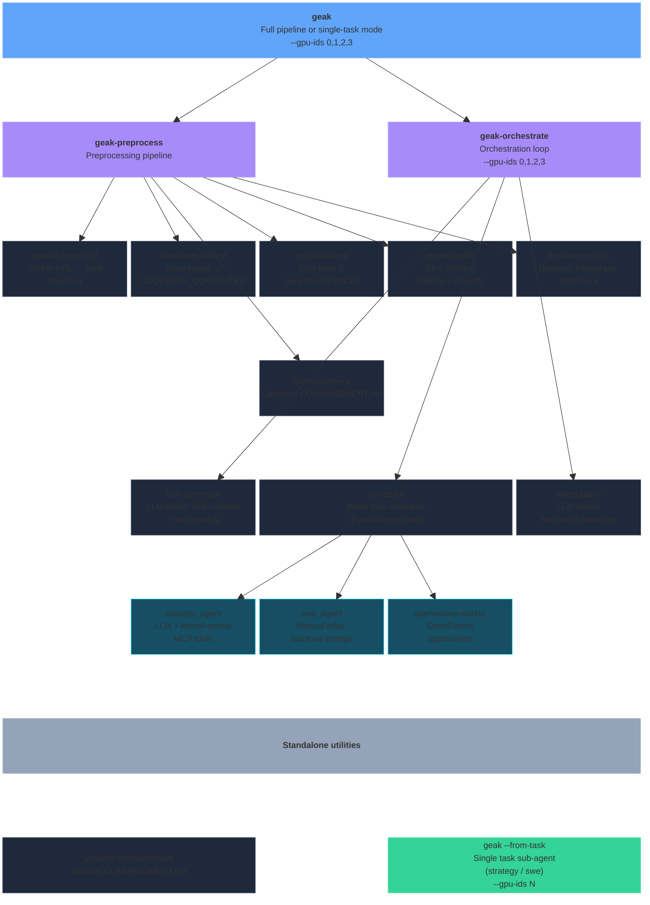

# GEAK — User-Facing Tools

```mermaid
block-beta
    columns 5

    geak["<b>geak</b>\nFull pipeline or single-task mode\n--gpu-ids 0,1,2,3"]:5

    space:5

    geak_preprocess["<b>geak-preprocess</b>\nPreprocessing pipeline"]:2
    space
    geak_orchestrate["<b>geak-orchestrate</b>\nOrchestration loop\n--gpu-ids 0,1,2,3"]:2

    space:5

    resolve["resolve-kernel-url\nGitHub URL → local\ncheckout"]
    context["codebase-context\nRepo layout →\nCODEBASE_CONTEXT.md"]
    discover["test-discovery\nFind tests &\nbenchmarks (MCP)"]
    profile["kernel-profile\nGPU profiling\n(Metrix + rocprof)"]
    baseline["baseline-metrics\nDuration, throughput,\nbottleneck"]

    space:5

    space:2
    commandment["commandment\nGenerate COMMANDMENT.md"]:1
    space:2

    space:5

    space
    task_gen["task-generator\nLLM-driven task creation\n--num-gpus N"]
    run_tasks["run-tasks\nBatch task execution\n(ParallelAgent pool)"]:2
    select_patch["select-patch\nLLM-based\nbest patch selection"]

    space:5

    space
    strategy["strategy_agent\nLLM + kernel-evolve\nMCP tools"]
    swe["swe_agent\nManual edits,\nautotune configs"]
    openevolve["openevolve-worker\nOpenEvolve\noptimisation"]
    space

    space:5

    standalone["<b>Standalone utilities</b>"]:5

    space:5

    validate["validate-commandment\nValidate COMMANDMENT.md"]:2
    space
    geak_task["geak --from-task\nSingle task sub-agent\n(strategy / swe)\n--gpu-ids N"]:2

    geak --> geak_preprocess
    geak --> geak_orchestrate
    geak_preprocess --> resolve
    geak_preprocess --> context
    geak_preprocess --> discover
    geak_preprocess --> profile
    geak_preprocess --> baseline
    geak_preprocess --> commandment
    geak_orchestrate --> task_gen
    geak_orchestrate --> run_tasks
    geak_orchestrate --> select_patch
    run_tasks --> strategy
    run_tasks --> swe
    run_tasks --> openevolve

    style geak fill:#60a5fa,color:#000,stroke:#93c5fd
    style geak_preprocess fill:#a78bfa,color:#000,stroke:#c4b5fd
    style geak_orchestrate fill:#a78bfa,color:#000,stroke:#c4b5fd
    style standalone fill:#94a3b8,color:#000,stroke:#cbd5e1
    style geak_task fill:#34d399,color:#000,stroke:#6ee7b7
    style resolve fill:#1e293b,color:#e2e8f0,stroke:#475569
    style context fill:#1e293b,color:#e2e8f0,stroke:#475569
    style discover fill:#1e293b,color:#e2e8f0,stroke:#475569
    style profile fill:#1e293b,color:#e2e8f0,stroke:#475569
    style baseline fill:#1e293b,color:#e2e8f0,stroke:#475569
    style commandment fill:#1e293b,color:#e2e8f0,stroke:#475569
    style task_gen fill:#1e293b,color:#e2e8f0,stroke:#475569
    style run_tasks fill:#1e293b,color:#e2e8f0,stroke:#475569
    style select_patch fill:#1e293b,color:#e2e8f0,stroke:#475569
    style strategy fill:#164e63,color:#a5f3fc,stroke:#22d3ee
    style swe fill:#164e63,color:#a5f3fc,stroke:#22d3ee
    style openevolve fill:#164e63,color:#a5f3fc,stroke:#22d3ee
    style validate fill:#1e293b,color:#e2e8f0,stroke:#475569
```
