# GEAK e2e_workflow — Master Flowchart (Head Kernel as an explicit LOOP)

> The whole optimization logic at a glance. The **Head Kernel** stage is drawn as an explicit loop: pick the next head kernel (highest %GPU first) → extract → bake-off/author → candidate e2e gate → keep/drop → **is there another head kernel (and budget) left? yes ↺ next head / no → Milestone**. Each box's first line is the module / role that owns it.

```mermaid
flowchart TD
    %% ---- node declarations (every node gets its full label up front) ----
    IN["Input (required)<br/>model + workload (isl/osl/conc) + GPUs<br/>caller's best config (used as the baseline seed)"]
    INTL["Input (optional) — upstream TraceLens profile<br/>analysis.md / kernel_candidates.json / roofline trace_file"]
    SETUP["Setup — director:setup<br/>build eval_dir + preflight env check (env_report)<br/>measure the TRUE baseline tok/s ON the seed config = the denominator for every later gain"]
    HASTL{"Profile — profiler (ROUND 0)<br/>TraceLens analysis.md provided?"}
    SELF["collect own warm-server trace → parse_profile.py"]
    FAST["fast path: skip own trace collection<br/>map TraceLens hot_kernels into the Top-N (source=tracelens)"]
    HASTRACE{"roofline trace_file also provided?"}
    EXTRA["extra parse_profile.py pass on the rank0 serving trace<br/>recover real kernel symbols + reliable per-launch shapes; reconcile (prefer parser shapes); source=tracelens+trace"]
    KEEP["keep TraceLens ranking / %gpu as-is"]
    PROFILE["Profile — build Top-N (common post-processing)<br/>de-inflate comm collectives (skew>3) + recompute table; split prefill/decode<br/>SANITY: at TP>1 the Top-N MUST contain a collective kernel, else trace invalid → re-collect"]
    STRAT["Strategize — system_architect<br/>Amdahl rank = pct_gpu_time × achievable_speedup<br/>route each kernel to config / head(≥5%) / small-kernel / host tracks"]
    CFGON{"Config Sweep — config_tuner<br/>config_tune enabled? (interface mode = off, caller already searched)"}
    SWEEP["sweep flags / env / backend, one axis at a time<br/>keep only if delta% > noise band AND output parity holds"]
    CFGGAIN{"gain over current baseline?"}
    CFGADOPT["adopt config (compound) → re-profile → re-strategize"]
    MILESTONE["Milestone loop — system_architect + recursive kernel_workflow + e2e_integrator<br/>optimize the smaller editable kernels (5% ~ head threshold), same e2e gate<br/>stop when the remaining headroom < noise band (Amdahl stop rule)"]
    FINALIZE["Finalize — e2e_integrator<br/>drain any pending A/Bs; assemble final/ bundle (overlay + patch + launch script)"]
    REPORT["Report — system_architect<br/>write architect_report + final_report (provisional numbers)"]
    VALIDATE["Validate — director (OFFICIAL number)<br/>same-session 2-launch A/B, baseline vs final<br/>accept only if gain > noise band, ranges non-overlapping, AND parity holds"]
    OUT["Output — result.json<br/>speedup + patch/overlay + self-contained reproducible launch script"]

    subgraph HEAD ["Head Kernel LOOP — iterate over head kernels ≥5% GPU (the biggest wins), until none left or head budget spent"]
        direction TB
        NEXTHEAD["pick the NEXT head kernel from the queue (highest %GPU first)"]
        EXTRACT["Extract — kernel_extractor<br/>freeze the hot kernel into an immutable test<br/>(golden I/O oracle + the real online kernel as the timing denominator → anti-cheat)"]
        BAKE["Bake-off + Author — op_benchmarker + recursive kernel_workflow<br/>tune the backend (aiter per-shape DB) AND author fresh kernels (flydsl / triton) in parallel"]
        CANDS["Candidate loop — e2e_integrator<br/>rank candidates by weighted speedup; test EACH on the live server (share one baseline); keep the highest MEASURED e2e"]
        HGATE{"e2e gate<br/>actually faster on the server AND output unchanged?"}
        HKEEP["keep — compound into overlay/config, then re-profile (bottleneck moved)"]
        HDROP["drop (if fixable → surgeon small-fix, then retry the gate)"]
        MOREHEADS{"another head kernel left AND head budget remaining?"}
        NEXTHEAD --> EXTRACT --> BAKE --> CANDS --> HGATE
        HGATE -->|"yes"| HKEEP --> MOREHEADS
        HGATE -->|"no / regression / output changed"| HDROP --> MOREHEADS
        MOREHEADS -->|"yes ↺ next head"| NEXTHEAD
    end

    %% ---- edges (all targets already have labels above) ----
    IN --> SETUP
    INTL -.-> SETUP
    SETUP --> HASTL
    HASTL -->|"no (or any re-profile round)"| SELF --> PROFILE
    HASTL -->|"yes"| FAST --> HASTRACE
    HASTRACE -->|"yes"| EXTRA --> PROFILE
    HASTRACE -->|"no"| KEEP --> PROFILE
    PROFILE --> STRAT --> CFGON
    CFGON -->|"off"| NEXTHEAD
    CFGON -->|"on"| SWEEP --> CFGGAIN
    CFGGAIN -->|"yes (has gain)"| CFGADOPT --> NEXTHEAD
    CFGGAIN -->|"no (no gain)"| NEXTHEAD
    MOREHEADS -->|"no"| MILESTONE
    MILESTONE --> FINALIZE --> REPORT --> VALIDATE --> OUT

    classDef q fill:#fff3cd,stroke:#d39e00;
    classDef key fill:#d1ecf1,stroke:#0c5460;
    classDef opt fill:#f3f3f3,stroke:#999,stroke-dasharray:4 3;
    class HASTL,HASTRACE,CFGON,CFGGAIN,HGATE,MOREHEADS q;
    class SETUP,PROFILE,STRAT,VALIDATE key;
    class INTL opt;
```

## How to read it

- **Inputs.** Required = model + workload (isl/osl/conc) + GPUs + the caller's best config (used as the baseline seed). Optional = an upstream TraceLens profile (dashed); when absent the workflow profiles itself, so a TraceLens-less run behaves identically.
- **Setup → baseline.** Build the eval dir, run a judgment-guided preflight env check, then measure the TRUE baseline throughput ON the seed config — that number is the denominator for every later gain.
- **Profile.** ROUND 0 only: if a TraceLens `analysis.md` is provided, take the fast path (and, when a roofline `trace_file` also exists, run an extra parse pass to recover real kernel symbols + reliable shapes); otherwise collect the trace itself. All paths converge on one normalized Top-N (de-inflate busy-wait collectives, split prefill/decode, sanity-check that a TP>1 trace contains a collective kernel).
- **Strategize.** Rank kernels by Amdahl impact `pct_gpu_time × achievable_speedup` and route them to the config / head / small-kernel / host tracks.
- **Config sweep.** Runs only when `config_tune` is enabled (off in interface mode, since the caller already searched configs). When on, it sweeps one axis at a time and keeps a change only if the gain clears the noise band and output parity holds; a kept config compounds and triggers a re-profile.
- **Head Kernel LOOP (the core).** A for-each loop over head kernels ≥5% GPU, highest %GPU first: extract the kernel into an immutable anti-cheat test → bake-off/author multiple backends in parallel → gate every candidate through a live-server e2e A/B and keep the highest **measured** e2e. After each head, `MOREHEADS` asks "another head kernel left AND head budget remaining?": **yes ↺** go back for the next head (a re-profile runs first after a keep, because the bottleneck has moved); **no** → exit to Milestone.
- **Milestone → Finalize → Report → Validate → Output.** Optimize the smaller editable kernels with the same e2e gate (stop when remaining headroom < noise band), assemble the deliverable bundle, then the Director re-measures baseline-vs-final in one same-session A/B — the OFFICIAL number, accepted only if the gain is non-overlapping and above the noise band with output parity intact.

> Guiding principle (Amdahl): a 5× speedup on a 2%-of-GPU kernel is invisible, whereas a 1.15× on a 78% kernel is +10% end-to-end — which is why the workflow tunes the free config first and then concentrates its budget on the biggest kernels.
