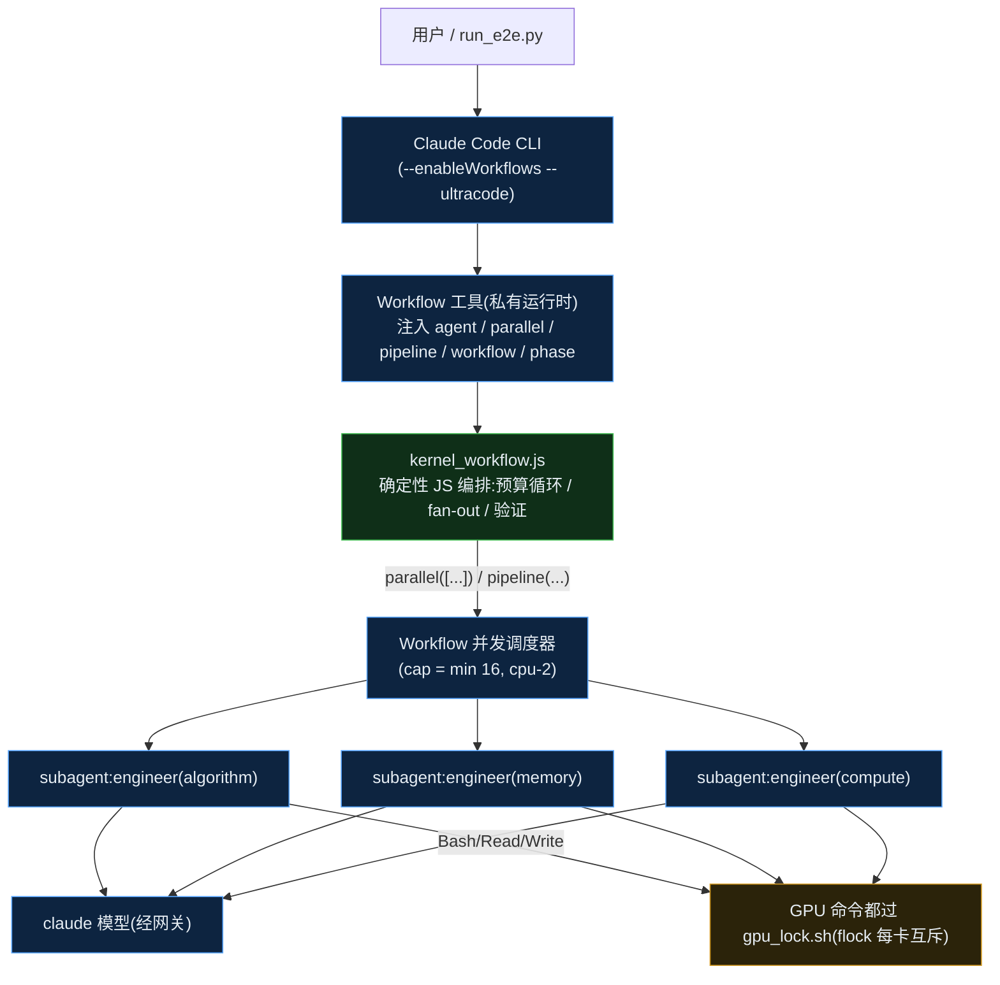
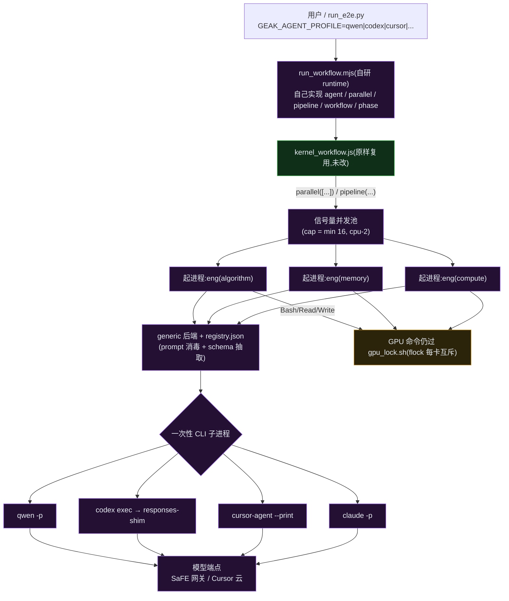
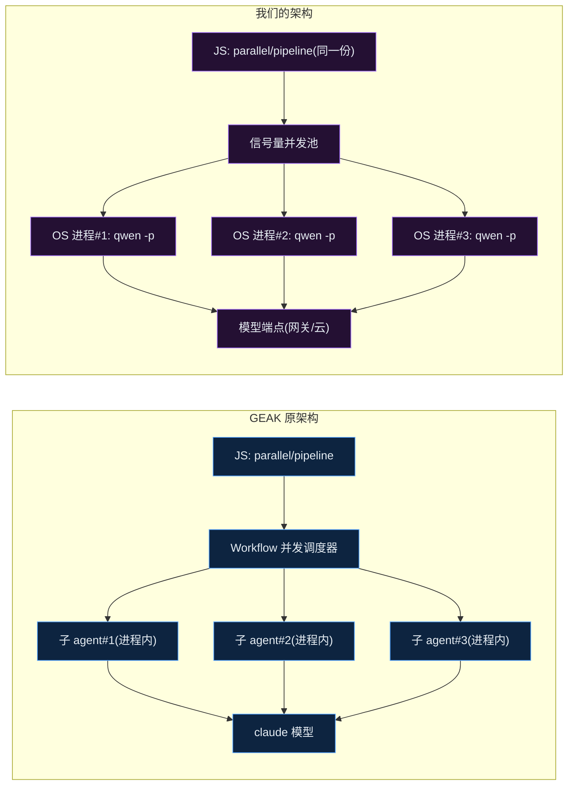
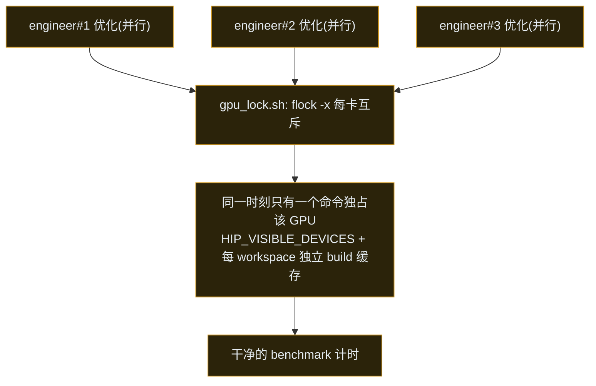

# GEAK 架构对比:原生 vs 可切换后端 runtime

> 在 Cursor / VS Code 打开本文件,按 `Cmd/Ctrl + Shift + V` 预览,下面的 Mermaid 图会渲染成图。
> 重点:**并行 subagent 在两种架构里分别怎么实现**。

---

## TL;DR

| | GEAK 原架构 | 我们的架构(本次新增) |
|---|---|---|
| 编排原语 `agent/parallel/pipeline/workflow` 由谁提供 | **Claude Code 的 `Workflow` 工具**(私有) | **自研 Node runtime**(`interface/runtime/`) |
| 一个 subagent 是什么 | Claude Code **进程内的子 agent 任务**(绑定 claude 模型) | **一个一次性 CLI 子进程**(qwen/codex/cursor/claude,可配置) |
| 并行 subagent 靠什么 | Workflow 工具的并发任务调度 | runtime 的**信号量 + OS 进程并发**(同时起 N 个 CLI 进程) |
| 能用的模型/agent | 只有 Claude Code + claude | **可切换**:qwen-code / codex / cursor / claude … 加一条配置即可 |
| GPU 测量冲突 | `gpu_lock.sh`(flock 每卡互斥) | **同一套 `gpu_lock.sh`**(workflow 的 .js 没改) |
| 核心 workflow `.js` | — | **一字未改**,直接复用 |

一句话:**两种架构跑的是同一套 GEAK workflow;区别只在"谁来执行 `agent()/parallel()` 这些原语、以及一个 subagent 到底是什么"。**

---

## 1. GEAK 原架构:一切跑在 Claude Code 的 `Workflow` 工具里

GEAK 的编排逻辑写在 `kernel_workflow.js` / `e2e_workflow.js`,但这些 `.js` **不是普通 Node 脚本** —— 它们依赖 Claude Code `Workflow` 工具在运行时注入的全局原语。

**要点:**
- `Workflow` 工具是 **Claude Code 私有的**;`agent()/parallel()/pipeline()` 只有它懂 → 所以原生 GEAK **只能用 Claude Code + claude 模型**。
- **一个 subagent = Claude Code 进程内派生的一个子 agent 任务**(自带工具循环 Bash/Read/Write,调用 claude 模型)。
- **并行 subagent = Workflow 工具的并发任务调度**:JS 里一句 `parallel([...])` / `pipeline(directions, optimize, verify)`,Workflow 就同时拉起多个子 agent 任务(并发上限 `min(16, cpu-2)`)。
- 编排是**确定性**的(第几轮几个角色、怎么验证,全写死在 JS),LLM 只做判断。

---

## 2. 我们的架构:把编排层搬出 Claude Code,后端可切换

我们写了一个**独立 Node runtime**(`interface/runtime/run_workflow.mjs`),自己实现那套原语;每个 `agent()` 落到一个**一次性 CLI 子进程**,由配置(`registry.json`)决定起哪个 CLI。

**要点:**
- runtime 用 `new AsyncFunction` 加载那两个 `.js`,注入自己实现的全局原语 → **同一套 workflow 不改一行**就能跑。
- **一个 subagent = 一个一次性 CLI 子进程**(`qwen -p` / `codex exec` / `cursor-agent --print` / `claude -p`),干完即退。
- 后端可切换:加一个 agent = 往 `registry.json` 加一段配置(bin/flags/prompt 投递/模型 flag),不写代码。
- 补齐 CLI 缺的能力:`schema.mjs` 模拟结构化输出;codex 的 `responses-shim` 让它能用 claude;prompt 消毒去掉 Claude 专有措辞。

---

## 3. 并行 subagent —— 两种架构的核心区别

同一句 `pipeline(directions, optimize, verify)`(一轮派 3 个工程师角色并行优化),两边发生的事:

| 维度 | GEAK 原架构 | 我们的架构 |
|---|---|---|
| 并行由谁做 | Claude Code Workflow 调度器 | **我们 runtime 的信号量 + OS 进程并发** |
| 一个并行单元 | 进程内子 agent 任务 | **一个独立 CLI 进程** |
| 需要 CLI 自己支持并行吗 | —(就是 Claude Code) | **不需要** —— CLI 只跑单任务,并行在 runtime 层 |
| 确定性 | ✅(JS 控制) | ✅(同一份 JS 控制) |
| 并发上限 | min(16, cpu-2) | min(16, cpu-2)(一致) |

> **关键洞察**:我们把"并行"从"agent 内部能力"下沉成了"**OS 进程级并发**"。所以哪怕 qwen-code/codex/cursor 各自**不支持**确定性/嵌套的并行 subagent,GEAK 的多角色并行照样成立 —— 这正是"可切换后端"能成立的根本原因。(实测:一轮 Optimize 里 3 个 CLI 进程同一时间戳并发启动。)

### 3.1 并行优化 vs 串行测量(GPU 冲突怎么处理)

两种架构**共用同一套** `scripts/gpu_lock.sh`(在 workflow 的 `.js` 里,我们没改):

- **agent 层面并行**(想 / 改 / 建),但**真正上 GPU 的命令按卡串行**(flock)→ 计时不被并发污染。
- 多卡时按 GPU id 分散 → 跨卡真并行;单卡时 flock 依次跑。
- 这层是 **GEAK 自带、与后端无关**,四种后端一视同仁。

---

## 4. 原语映射(我们 runtime 如何等价实现 Workflow 工具)

| Workflow 工具原语 | 我们的实现(`run_workflow.mjs`) |
|---|---|
| `agent(prompt, {schema})` | 起一个 CLI 子进程;`schema.mjs` 注入 JSON 契约 + 抽取校验重试 |
| `parallel(thunks)` | `Promise.all` + 信号量;抛错落 null |
| `pipeline(items, ...stages)` | 逐项、阶段间无 barrier;stage 抛错该项落 null |
| `workflow(ref, args)` | 同 runtime 内跑另一个 `.js`,一层嵌套(e2e 递归 kernel 层靠它) |
| `phase/log` | stderr 进度 |
| `budget` | stub(GEAK 未用 token 预算;轮数/时间在 JS 内控制) |

---

## 5. 原生 vs 我们新增(边界)

- **GEAK 原生(未改)**:`kernel_workflow.js` / `e2e_workflow.js` / `roles/` / `knowledge/` / `scripts/`(含 `gpu_lock.sh`)。原生只认 Claude Code。
- **我们新增(`interface/runtime/`)**:`run_workflow.mjs`、`config.mjs`+`registry.json`、`backends/{base,generic}.mjs`、`schema.mjs`、`experiment.mjs`、`responses_shim.mjs`(codex+claude 用),以及 `run_e2e.py` 里的后端分支。"加后端=加配置"是这一层带来的,**原版 GEAK 没有**。

---

## 6. 实测验证(parity,knn,claude-opus-4-8)

| 壳 | 模型 | 加速比 | 轮数 |
|---|---|---|---|
| 原生 GEAK(Claude Code) | claude-opus-4-8 | 18.81x | 4 |
| qcoder(我们 runtime) | claude-opus-4-8 | 20.66 / 13.81x | 3 |
| codex(我们 runtime + shim) | claude-opus-4-8 | 10.70 / 7.99x | 2–3 |
| cursor(我们 runtime) | composer-2.5 | 17.00x(flagged) | 2 |

**结论**:同 workflow、同模型下,原生 Claude Code(18.81x)与我们 runtime 的 qcoder(20.66/13.81x)**同一量级** → **runtime 忠实,搬出 Claude Code 没削弱 GEAK**;且壳会影响结果(codex 明显偏弱、早停)。

> 相关文档:`DEV_SUMMARY.md`(总体)、`OVERVIEW.md`(改造概览)、`COMPAT_findings.md`(各 CLI 兼容坑)、`RESEARCH_cli_parallelism.md`(各 CLI 并行能力调研)。
