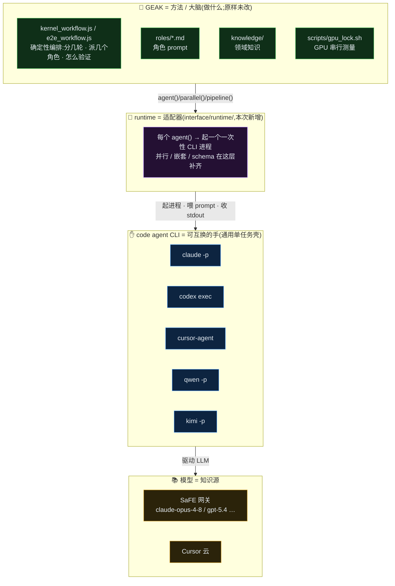

# GEAK 可切换 code-agent 后端 —— 设计文档

> 范围:**后端支持层**的设计 —— 契约、配置模型、每个 CLI(claude / qwen / codex / cursor / kimi)如何接入、runtime 为 CLI 补齐了哪些能力、以及如何加一个新后端。
> 编排 / 并行的对比见 `ARCHITECTURE.md`;各 CLI 兼容坑清单见 `COMPAT_findings.md`;并行能力调研见 `RESEARCH_cli_parallelism.md`。

---

## 0. 总结

GEAK 的 workflow(`kernel_workflow.js` / `e2e_workflow.js`)原本只能跑在 Claude Code 的私有 `Workflow` 工具里。我们把编排层搬进一个独立 Node runtime,让每个 `agent()` 落到**一个一次性 CLI 子进程**;换后端 = 改 `registry.json` 里一段配置,**不写代码**。workflow 的 `.js` / `roles/` / `knowledge/` / `scripts/` **一字未改**。

> **绝对路径根**
> - 仓库:`/shared_nfs/hongtaom/GEAK-code-agent-test`(分支 `feat/swappable-agent-backends`)
> - 本层:`/shared_nfs/hongtaom/GEAK-code-agent-test/interface/runtime/`
> - 外置运行件:`/shared_nfs/hongtaom/tools/`(shim、env 脚本 —— **不在 git 里**)

---

## 概念对比:GEAK 是什么 · code agent CLI 是什么

一句话:**GEAK 是"方法/大脑"(做什么),code agent CLI 是"可互换的手"(怎么跑一步),模型是"知识源"。**

- **GEAK** = 一套**确定性的 kernel 生成/优化方法**(垂直领域:AMD GPU kernel)。由 `kernel_workflow.js` / `e2e_workflow.js`(编排:分几轮、派几个角色、怎么验证)+ `roles/*.md`(角色 prompt)+ `knowledge/`(领域知识)+ `scripts/gpu_lock.sh`(GPU 串行测量)组成。**它本身不是一个能执行的 agent** —— 需要一个"执行壳"来真正跑每个 `agent()`。
- **code agent CLI**(claude / codex / cursor / qwen / kimi) = **通用的单任务执行壳**。接一个 prompt,自带 Bash/Read/Write 工具循环,驱动某个 LLM,把一个任务跑完并打印结果。**它不懂 GEAK 的编排**,只当"一双手"—— 所以可互换。
- **runtime**(本层) = **适配器**,把 GEAK 的 `agent()` 翻译成"起一个一次性 CLI 进程",并补齐 CLI 缺的并行 / 结构化输出。



| 维度 | GEAK | code agent CLI |
|---|---|---|
| 是什么 | 确定性 workflow **方法**(垂直:GPU kernel) | 通用**单任务** coding agent 壳 |
| 提供什么 | 做什么 · 分几轮 · 派几个角色 · 怎么验证 · 怎么测 GPU | 跑完一个 prompt 并打印结果 |
| 懂领域吗 | 懂(roles + knowledge) | 不懂(通用) |
| 能单独跑吗 | **不能**(需一个执行壳) | 能(但没 GEAK 就只是个裸 agent) |
| 可互换吗 | 不换(就这一套方法) | **可互换**(claude/codex/cursor/qwen/kimi) |
| 谁做并行 | 写在 `.js`(`parallel`/`pipeline`) | 不做 —— runtime 起 N 个进程 |
| 结构化输出 | schema 契约写在 workflow | 大多没有原生 schema → runtime 模拟 |

> 类比:GEAK 是**菜谱 + 主厨的方法论**,CLI 是**可替换的厨师**,模型是**厨师的知识**。换厨师(CLI)不改菜谱(GEAK),这就是"可切换后端"。

---

## 1. 设计目标 / 非目标

**目标**
- **同一套 workflow,可切换执行壳**:qwen-code / codex / cursor / claude,做 (agent × model) 对照实验。
- **加后端 = 加配置**:常见 CLI 靠 `registry.json` 一条数据接入,零代码。
- **不改 GEAK 原生资产**:`.js` / roles / knowledge / scripts 保持原样,升级 GEAK 不冲突。
- **忠实复现原生行为**:并行、嵌套、结构化输出、重试语义都与 Claude Code `Workflow` 工具对齐(parity 见 ARCHITECTURE.md §6)。

**非目标**
- 不依赖任何 CLI 自带的并行 / 嵌套 subagent 能力(它们都"模型驱动、不可复现、嵌套受限",见 RESEARCH)。并行下沉到 runtime。
- 不做 token / 成本记账(GEAK 用轮数+时间控制,`budget` 是 stub)。
- 不追求"按角色配不同模型"(用户明确暂缓)。

---

## 2. 三条核心设计决策

### 2.1 一个 subagent = 一个一次性 CLI 子进程
一次 `agent(prompt, {schema})` → 起一个进程、把 prompt 喂进去、跑完 agentic 循环、从 stdout 收最终文本、进程退出。**CLI 只需会"非交互跑一个带 Read/Write/Bash 的任务到结束并打印结果"**,不需要它支持并行 / 嵌套 / 结构化工具。这是"可切换后端"能成立的根本前提(COMPAT_findings §一 已 grep 证实 GEAK 角色都是单 agent、只用 Read/Write/Bash、不联网、不用 MCP、无硬编码模型)。

### 2.2 编排在 runtime,不在 CLI
`agent / parallel / pipeline / workflow / phase / log / budget` 全由 `run_workflow.mjs` 自己实现(`createRuntime`)。并行 = **信号量 + OS 进程并发**(`Semaphore`,cap = `min(16, cpu-2)`,与 Workflow 工具一致)。所以哪怕 CLI 自己不支持确定性并行,GEAK 的多角色并行照样成立。

### 2.3 配置优先于代码(两轴 registry + 单一 generic 后端)
差异尽量表达成 `registry.json` 的数据,由**唯一的** `backends/generic.mjs` 消费。只有当某 CLI 的行为 registry 表达不了时,才写一个 `backends/<name>.mjs` 覆盖(escape hatch,见 §8)。目前 claude/qwen/codex/kimi 全走 generic;cursor 也走 generic(cursor 的特殊性在"云端点",不在调用方式)。

---

## 3. 分层架构

```
workflow .js (原样)
  │  调用 agent()/parallel()/pipeline()/...
  ▼
run_workflow.mjs  ── createRuntime(): 实现原语 + 信号量并发 + schema 重试
  │  每个 agent() → backend.runAgent({prompt,label,cwd,env,model,timeoutMs})
  ▼
backends/generic.mjs  ── makeGenericBackend(resolved recipe)
  │  buildInvocation(agent, model, prompt)  →  {cmd, args, promptOnStdin, env}
  ▼
backends/base.mjs  ── spawnAgent(): 起子进程 / 喂 stdin / 收 stdout / 硬超时
  ▼
一次性 CLI 子进程:  qwen -p   |   codex exec   |   cursor-agent --print   |   claude -p
  ▼
模型端点:  SaFE 网关(OpenAI/Responses 兼容)   |   Cursor 云
```

### 后端契约(`backends/base.mjs` 顶部注释即规范)
一个 backend 模块导出:
- `name: string`
- `async runAgent({ prompt, label, cwd, env, model, timeoutMs }) -> { text }`
  - resolve 出 agent 的最终 stdout 文本(**schema 解析是 runtime 的事,不是 backend 的事**)。
  - 非零退出 / spawn 失败 / 超时 → **throw**,交给 runtime 的重试 + 降级为 null 路径。

`spawnAgent`(共享助手)约定:prompt 默认走 **stdin**(避免大 prompt 撞 `ARG_MAX`);`promptOnStdin=false` 时 prompt 作为最后一个位置参数;硬超时 `SIGKILL`;非零退出**不**在此 reject,由调用方(generic 后端)决定(它默认当错误抛)。

---

## 4. 两轴配置模型(registry.json)

两个**正交**的轴 + 一个组合:

| 轴 | 含义 | 例 |
|---|---|---|
| `agents[]` | **怎么驱动一个 CLI**(bin / flags / prompt 投递 / 方言 / env),模型无关 | `codex`, `qwen`, `cursor` |
| `models[]` | **一个端点**(id + base_url + key 的 env 名),CLI 无关 | `opus48`, `gpt54` |
| `profiles[]` | 钉住一个 (agent, model) 组合 | `codex-opus48` = codex × opus48 |

选择优先级(`selectBackend` + `resolveSelection`):
**CLI flag(`--profile/--agent/--model`)> env(`GEAK_AGENT_PROFILE/-BACKEND/-MODEL`)> `registry.default_profile`**。
`GEAK_AGENT_BACKEND` 是 `--agent` 的后兼容别名。

### agent 记录的字段(config.mjs `buildInvocation` 消费)
| 字段 | 作用 |
|---|---|
| `bin` / `bin_env` | 可执行名;`bin_env` 指定的环境变量可覆盖(如 `GEAK_CODEX_BIN`) |
| `prompt` | `"stdin"`(默认)或 `"arg"`(作为最后位置参数,kimi/cursor 用) |
| `args[]` | 固定参数(headless / 自动批准 / 放宽沙箱) |
| `approve` / `approve_env` | 自动批准 flag;env 可覆盖,空串禁用 |
| `model_flag` + `model.id` | 模型选择:`模型 override > model.id > model_env` |
| `base_url_env` | 把 `model.base_url` 路由到该 CLI 认的 env(方言决定,见 §6) |
| `env{}` | 该 CLI 固定要设的环境变量 |
| `extra_args_env` | 逃生阀:临时塞 build 专属 flag,不改 registry |
| `dialect` / `structured` / `note` | 元数据 / 文档(dialect 目前是标注,路由靠 `base_url_env`) |

> 关键:**base_url 永远从 registry 注入,key 永远只在 env**(`key_env` 指名),密钥不进文件。做"同模型不同 CLI"对照时,让所有 profile 的 model 指向同一个网关 base_url 即可。

---

## 5. runtime 为 CLI 补齐的三样东西

CLI 通用性来自"补齐差异",这三处是 runtime 层填的坑:

### 5.1 结构化输出模拟(`schema.mjs`)
Claude Code 有强制 `StructuredOutput` 工具;普通 CLI 没有。做法:
1. `schemaInstruction(schema)` 把 JSON-Schema 追加成一段 **OUTPUT CONTRACT**("最后打印**唯一一个** ```json 代码块,后面别再有字")。
2. `extractJson(text)` 从自由文本 stdout 里抽 JSON:优先**最后一个** ```json 围栏 → 最后一个能 parse 的围栏 → 最后一个平衡括号片段(带字符串转义处理)。
3. `validate(obj, schema)` 轻量校验(top-level type + required + 递归 properties/items),够抓"形状不对"这个最常见失败。
4. runtime 内重试 `GEAK_SCHEMA_RETRIES`(默认 2)次;仍失败就 throw,交给 workflow 里 `agentT()` 的外层重试/降级为 null —— 与原生"StructuredOutput miss"处理一致。失败次数计入 `state.schemaFails`(metrics)。

### 5.2 prompt 消毒(`config.mjs` `neutralizeForBackend`)
roles/`.js` 里写死了 Claude 语义(如 `"a StructuredOutput tool is forced"`),对别的 CLI 是误导且**不改源文件**。runtime 在 `backend.name !== 'claude'` 时对最终 prompt 做纯字符串替换(换成"以单个 ```json 代码块返回")。claude 后端为 no-op。

### 5.3 并行 / 嵌套(`run_workflow.mjs`)
`parallel` = `Promise.all` + 信号量,抛错落 null;`pipeline` = 逐项、阶段间无 barrier,stage 抛错该项落 null;`workflow()` = 同 runtime 内跑另一个 `.js`,**一层嵌套**(e2e 递归 kernel 层靠它);`MAX_TOTAL_AGENTS=1000` 生命周期兜底。全部与 Workflow 工具语义对齐。

---

## 6. 方言与端点路由

三种 wire 方言,决定 base_url 注到哪个 env、以及能否直连网关:

| 方言 | base_url 注入的 env | 端点 | 代表 CLI |
|---|---|---|---|
| `anthropic` | `ANTHROPIC_BASE_URL` | SaFE 网关 `/v1`(Anthropic) | claude |
| `openai` | `OPENAI_BASE_URL` | SaFE 网关 `…/llm-proxy/v1`(OpenAI 兼容) | qwen, kimi(经 config) |
| `openai`+`responses` | (经 config.toml provider) | SaFE 网关 `/v1/responses` **← 需 shim** | codex |
| `cursor-cloud` | 无 base_url | **Cursor 私有云**,进不了网关 | cursor |

SaFE 网关:`https://global.primus-safe.amd.com/api/v1/llm-proxy/v1`;`ak-` key(= 环境里的 `ANTHROPIC_API_KEY`)对 OpenAI/Anthropic 端点通用;TLS 要 CA `/shared_nfs/hyperloom/ca/amd-ca-combined.pem`(Node 侧 `NODE_EXTRA_CA_CERTS`,Rust/codex 侧 `SSL_CERT_FILE`)。可用模型:`claude-opus-4-8` / `opus-5` / `gpt-5.4` / `5.6`。

---

## 7. 各后端逐一设计

### 7.1 claude(基准)
`claude -p --dangerously-skip-permissions --allowedTools Bash Read Write`,prompt 走 stdin,方言 anthropic,`base_url_env=ANTHROPIC_BASE_URL`,`env.IS_SANDBOX=1`。prompt 不消毒(原生措辞对它是对的)。作为 parity 基准。

### 7.2 qwen / qcoder(✅ 已端到端验证)
`qwen -p --yolo [-m <model>]`,stdin,方言 openai,`base_url_env=OPENAI_BASE_URL`。两个非交互坑(已固化):
- `~/.qwen/settings.json` = `{"security":{"auth":{"selectedType":"openai"}}}`(env 脚本幂等写入)。
- `--yolo` 无 sandbox 告警 → `QWEN_CODE_SUPPRESS_YOLO_WARNING=1`(registry `qwen.env`)。
OpenAI 兼容,直连网关,是最干净的一个后端。

### 7.3 codex(✅,靠自研 responses-shim)
`codex exec --dangerously-bypass-approvals-and-sandbox [-m <model>]`,stdin,方言 openai + **`wire_api="responses"`**;Rust bin 用 **`SSL_CERT_FILE`**(不是 `NODE_EXTRA_CA_CERTS`);provider 走 **`CODEX_HOME/config.toml`**,不认 `OPENAI_BASE_URL`。

- **gpt-5.4 可直连网关** `/v1/responses`(profile `codex-gpt54`)。
- **claude-opus-4-8 必须经 shim**(profile `codex-opus48`)。原因:codex 直连网关跑 claude 会 500 —— 网关内部 LiteLLM 把 codex 的 `type:"namespace"`(multi_agent_v1)工具转 Anthropic 时不认;且网关对 claude 的**流式** `/responses` 坏、**非流式**好。解法见 §9。

### 7.4 kimi(✅ 已跑通)
`kimi --quiet --afk -p <prompt>`,**prompt 走 arg**(`prompt:"arg"`,`-p` 的值必须是最后一个参数,所以 generic 路径对 kimi 不加 `-m`,模型走 config)。`--quiet`=只打印最终文本,`--afk`=无人值守自动批准;需 `SSL_CERT_FILE`。provider 走 `~/.kimi/config.toml`:`[providers.safe] type="openai_legacy" base_url=…/llm-proxy/v1 api_key=<ak>` + `default_model="claude-opus-4-8"`。
> 装包坑:官方是 **PyPI `kimi-cli`**(`uv tool install --python 3.13 kimi-cli`);npm 的 `kimi-code`/`kimi-cli` 是**错包**。

### 7.5 cursor(✅ 能跑,但永远进不了网关对照)
`cursor-agent --force --print --output-format text [--model <id>]`,prompt 走 arg,方言 `cursor-cloud`,**无 base_url**。认证靠 `cursor-agent login`(AMD_CURSOR 团队账号,登录态在 `~/.config/cursor/auth.json`,可挂进容器复用)或 `CURSOR_API_KEY`。
> **结构性限制**:cursor SDK/CLI 走 Cursor 私有云(`api2.cursor.sh`;`CURSOR_BACKEND_URL` 只能指向自建 Cursor 后端,SaFE 网关不实现该协议)→ **cursor 永远无法经 SaFE 网关跑同模型对照**,数据也外发 Cursor 云。模型是 Cursor 侧 id(如 `composer-2.5`)。hyperloom 自己也是 cursor 走 Cursor 云、只有 claude/codex 走网关。

---

## 8. responses-shim 设计详解(codex + claude 的关键件)

`/shared_nfs/hongtaom/tools/responses_shim.mjs`,监听 `127.0.0.1:8791`。**注意:它是 `tools/` 下的外置运行件,不进 git 分支**(由 `env.safe-gateway.sh` 的 `ensure_shim` 拉起;codex 经 `~/.codex/config.toml` 或 `CODEX_HOME/config.toml` 的 provider `safe_shim` → `http://127.0.0.1:8791/v1`,`wire_api="responses"`)。

**它做什么(全程停留在 Responses schema,不跨协议)**:
1. **De-stream**:把 codex 的 `/responses` 请求转发到网关同名端点,但强制 `stream:false`(网关对 claude 的非流式 responses 正确完整,流式会让 codex 重连打转),再用完整结果**合成**标准 OpenAI Responses SSE 事件序列(`response.created` → `output_item` → `output_text.delta/done` → `function_call_arguments.*` → `response.completed`)。
2. **规范化**:网关 `/responses` 返回带 `object:"chat.completion"` 等 chat 味字段;shim 改成 `object:"response"`,补 `resp_/msg_/fc_` id、`text.format`、`reasoning`。
3. **剥 namespace 工具**:`sanitizeTools` 只保留 `type:"function"`,丢掉 codex 的 `type:"namespace"`(否则 LiteLLM 转 Anthropic 时 500;而且我们本就不想让 codex 自己 spawn 子 agent,编排在外)。

数据流:`codex --(responses, config provider)--> shim :8791 --(responses, stream:false)--> 网关 --> claude-opus-4-8`。
`SHIM_DEBUG=1` 会把 req/upstream dump 到 `tools/shim_{req,upstream}.json`。

---

## 9. 逃生阀:自定义 `backends/<name>.mjs`

`selectBackend` 会先 `import ./backends/<agentName>.mjs`;若它导出 `runAgent`,就用它、跳过 generic。用于 registry 表达不了的行为(如需要预处理 stdout、特殊认证握手)。合同同 §3。目前无常驻自定义后端(claude/qwen/codex/kimi/cursor 都走 generic);历史上的 `claude.mjs`/`qwen.mjs` 已并入 registry+generic 删除。

---

## 10. 加一个新后端的步骤(bring-up 清单)

1. `<cli> --help` 定死:R2 headless 命令、R3 自动批准+**放宽沙箱** flag、R6 认证 env(见 COMPAT_findings §二 R1–R7)。
2. 往 `registry.json` `agents[]` 加一段(bin / prompt stdin|arg / args / model_flag / base_url_env / dialect / env);需要就加 `models[]` 和 `profiles[]`。
3. `node selftest.mjs`(假后端)确认 runtime 本身 OK。
4. **冒烟单任务**:用该 CLI 跑一个最小 schema agent(如 director:setup),重点看 R1(能否拿到合法 JSON)。
5. 端到端:`kernel_workflow` @ `examples/tasks/knn`,统计 R1 失败率、R4 有没有被单命令超时截断。
6. 与 claude 后端 parity 对比。
> 表达不了才写 `backends/<name>.mjs`。多数 CLI 到第 2 步就够。

---

## 11. 后端横向对比

### 11.1 能力矩阵(怎么接)

| CLI | headless 命令 | prompt 投递 | 结构化输出 | 端点 / 认证 | 沙箱 flag | 网关对照 |
|---|---|---|---|---|---|---|
| claude | `claude -p` | stdin | 原生(措辞不消毒) | 网关 Anthropic / ak- | `--dangerously-skip-permissions` | ✅ |
| qwen | `qwen -p --yolo` | stdin | schema.mjs 抽取 | 网关 OpenAI / settings.json | `--yolo`+suppress | ✅ |
| codex | `codex exec` | stdin | schema.mjs 抽取 | 网关 Responses / **shim**+SSL_CERT_FILE | `--dangerously-bypass-approvals-and-sandbox` | ✅(经 shim) |
| kimi | `kimi --quiet --afk -p` | **arg** | schema.mjs 抽取 | 网关 / config.toml(openai_legacy) | `--afk` | ✅ |
| cursor | `cursor-agent --force --print` | **arg** | schema.mjs 抽取 | **Cursor 云** / login\|CURSOR_API_KEY | `--force` | ❌(私有云) |

### 11.2 实测对比(knn,同 workflow · 同模型 claude-opus-4-8)

> GPU 实测 + Director 复核;两个加速比是不同 run 的取值;bring-up 状态见 §7。

| 壳(后端) | 模型 | 加速比 | 轮数 | 状态 |
|---|---|---|---|---|
| **原生 GEAK**(Claude Code Workflow) | claude-opus-4-8 | **18.81x** | 4 | 基准 |
| **qcoder**(我们 runtime) | claude-opus-4-8 | **20.66 / 13.81x** | 3 | ✅ 与原生同量级 |
| **codex**(我们 runtime + shim) | claude-opus-4-8 | **10.70 / 7.99x** | 2–3 | ✅ 偏弱、早停 |
| **cursor**(我们 runtime) | composer-2.5 | **17.00x**(flagged) | 2 | ✅ 但走 Cursor 云、非同模型 |
| kimi(我们 runtime) | claude-opus-4-8 | — | — | ✅ 登录节点 schema 通,GPU 端到端待跑 |

**两条结论**:
- **runtime 忠实**:原生 18.81x ≈ qcoder 20.66/13.81x(同量级)→ 把编排搬出 Claude Code **没削弱 GEAK**。
- **壳会影响结果**:codex(+shim)明显偏弱、早停;cursor 因走私有云、模型不同,不能算严格同模型对照。

### 11.3 native vs runtime(编排层在哪)

| | 原生 GEAK | 我们的 runtime |
|---|---|---|
| 编排原语由谁提供 | Claude Code `Workflow` 工具(私有) | 自研 `run_workflow.mjs` |
| 一个 subagent 是什么 | 进程内子 agent 任务(绑定 claude) | **一个一次性 CLI 进程**(可切换) |
| 并行靠什么 | Workflow 调度器 | 信号量 + OS 进程并发 |
| 能用的壳/模型 | 只有 Claude Code + claude | qwen/codex/cursor/kimi/claude ×(网关模型) |
| workflow `.js` | — | **一字未改复用** |

> 图见 `/shared_nfs/hongtaom/GEAK-code-agent-test/interface/runtime/ARCHITECTURE.md`(§1–§3 带 Mermaid)。

---

## 12. 已知限制与取舍

- **cursor 进不了 SaFE 网关**,无法做"同模型不同 CLI"严格对照,且数据外发。
- **codex+claude 依赖外置 shim**:shim 不在 git、须先起(`ensure_shim`);`CODEX_HOME` 若指向不可读的 config(如容器里 root 建的 600 文件)会加载不到 provider —— 用可读的 `~/.codex` 或 chown。
- **结构化输出是模拟**:靠"请输出 json"+抽取+重试,不是原生 schema 工具,复杂 schema 失败率需在真任务上盯(计入 `schema_failures` metrics)。
- **壳影响结果**:parity 显示 codex(+shim)明显偏弱、早停;qcoder ≈ 原生(ARCHITECTURE.md §6)。
- **无 token/成本记账**:`budget` 是 stub,按设计。

---

## 13. 文件清单(绝对路径)

本层根:`/shared_nfs/hongtaom/GEAK-code-agent-test/interface/runtime/`

| 绝对路径 | 职责 |
|---|---|
| `/shared_nfs/hongtaom/GEAK-code-agent-test/interface/runtime/run_workflow.mjs` | runtime 核心:原语实现 / 信号量并发 / schema 重试 / CLI 入口 / 后端选择 |
| `/shared_nfs/hongtaom/GEAK-code-agent-test/interface/runtime/config.mjs` | registry 加载、选择解析、`buildInvocation` 组装、prompt 消毒 |
| `/shared_nfs/hongtaom/GEAK-code-agent-test/interface/runtime/registry.json` | agents × models × profiles 配置(加后端改这里) |
| `/shared_nfs/hongtaom/GEAK-code-agent-test/interface/runtime/backends/base.mjs` | 后端契约 + `spawnAgent` 子进程助手 + 并发上限 |
| `/shared_nfs/hongtaom/GEAK-code-agent-test/interface/runtime/backends/generic.mjs` | 唯一的 config-driven 后端 |
| `/shared_nfs/hongtaom/GEAK-code-agent-test/interface/runtime/schema.mjs` | 结构化输出模拟:instruction / extract / validate |
| `/shared_nfs/hongtaom/GEAK-code-agent-test/interface/runtime/experiment.mjs` | (agent × model) 对照实验 runner |
| `/shared_nfs/hongtaom/GEAK-code-agent-test/interface/runtime/selftest.mjs` | 用假后端单测 runtime 原语(无需真 CLI/网络/GPU) |
| `/shared_nfs/hongtaom/tools/responses_shim.mjs` | **外置(不在 git)**:codex+claude 的 de-stream 代理,监听 :8791 |
| `/shared_nfs/hongtaom/tools/env.safe-gateway.sh` | **外置(不在 git)**:一键设 PATH/key/CA + `ensure_shim` |
| `~/.codex/config.toml`(= `/home/hongtaom/.codex/config.toml`) | codex provider `safe_shim` → shim(用户可读的那份) |

**GEAK 原生资产(未改,绝对路径)** —— 在仓库根、**不在** `interface/` 下:
- `/shared_nfs/hongtaom/GEAK-code-agent-test/kernel_workflow/kernel_workflow.js`(及 `kernel_workflow_bmk.js`)
- `/shared_nfs/hongtaom/GEAK-code-agent-test/e2e_workflow/e2e_workflow.js`
- `/shared_nfs/hongtaom/GEAK-code-agent-test/{kernel_workflow,e2e_workflow}/roles/` 和 `.../knowledge/`
- `/shared_nfs/hongtaom/GEAK-code-agent-test/kernel_workflow/scripts/gpu_lock.sh`

> 相关文档(同目录):
> - `/shared_nfs/hongtaom/GEAK-code-agent-test/interface/runtime/ARCHITECTURE.md` —— 编排 / 并行"原生 vs runtime"对比(带 Mermaid)
> - `/shared_nfs/hongtaom/GEAK-code-agent-test/interface/runtime/COMPAT_findings.md` —— R1–R7 兼容坑
> - `/shared_nfs/hongtaom/GEAK-code-agent-test/interface/runtime/RESEARCH_cli_parallelism.md` —— 各 CLI 并行调研
> - `/shared_nfs/hongtaom/GEAK-code-agent-test/interface/runtime/DEV_SUMMARY.md` · `OVERVIEW.md`
</content>
</invoke>
