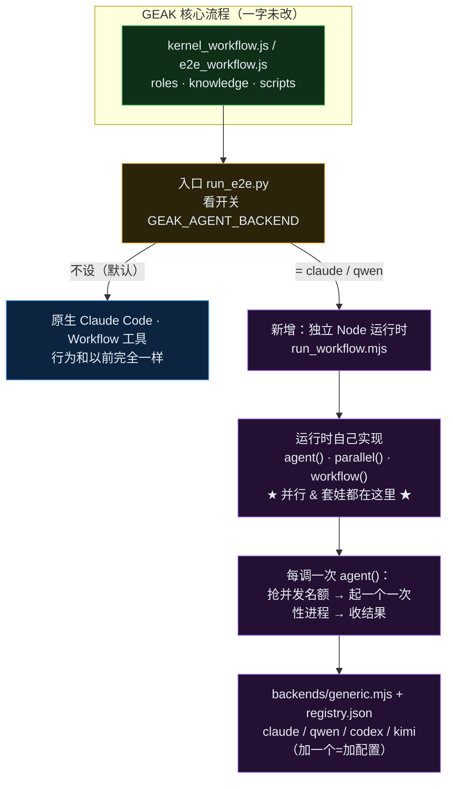
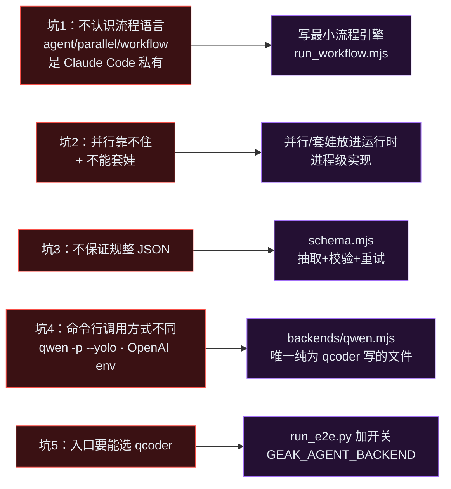
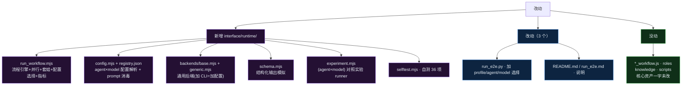

# GEAK · 可切换 code-agent 后端(适配 qcoder)

> 在 Cursor 里打开本文件 → 点右上角预览(`Cmd/Ctrl + Shift + V`),下面的图会直接渲染。

---

## 1. 架构总览



**关键点**:并行和套娃由**运行时在进程级完成**,qcoder 只当"跑单活的进程"——
所以"qcoder 不能并行 / 不能嵌套"被彻底绕开。

---

## 2. 适配 qcoder:每个坑 → 对策 → 为什么



| # | 为什么这么改 |
|---|---|
| 1 | 硬门槛:文件先跑得起来,后面才谈得上 |
| 2 | **方案关键**:不依赖 qcoder 的并行 → 你担心的问题直接绕开 |
| 3 | 补上缺的格式保证(**最大风险点**,得真跑才知道听不听话) |
| 4 | qcoder 特有细节关在一处;换别的 agent 只加同类小文件 |
| 5 | 一个环境变量切换,且**默认行为完全不变** |

---

## 3. 文件清单



---

## 4. 改造前 vs 改造后

| 维度 | 改造前 | 改造后 |
|---|---|---|
| 能用的 agent | 只有 Claude Code(焊死) | claude / qcoder **可切换** |
| 换 agent 成本 | 做不到 | **改一个环境变量** |
| 并行/套娃 谁负责 | Claude Code | **运行时**(不依赖 agent) |
| GEAK 核心流程 | — | **一字未改** |
| 默认行为 | Claude Code | **不变**(不设开关=老路) |

---

## 5. 用法

```bash
# 用 qcoder 跑 e2e（不设 = 原生 Claude，行为不变）
export GEAK_AGENT_PROFILE=qwen         # 或 GEAK_AGENT_BACKEND=codex / GEAK_MODEL=...
npm i -g @qwen-code/qwen-code          # 需 Node ≥ 18 + 可达端点
python interface/run_e2e.py handoff.json result.json

# 单内核直接用运行时
node interface/runtime/run_workflow.mjs kernel_workflow/kernel_workflow.js --profile qwen --args '{...}'

# (agent × model) 对照实验
node interface/runtime/experiment.mjs --script kernel_workflow/kernel_workflow.js \
  --agents claude,qwen,codex --models default --repeats 3 --args '{...}'

# 逻辑自测（无需 GPU/网络，36 项）
node interface/runtime/selftest.mjs
```

> 一句话:没有改 GEAK 去迁就任何 CLI,而是**补齐它们缺的确定性编排能力**,再用配置把它们接进来。
> 详见 `DEV_SUMMARY.md`。
