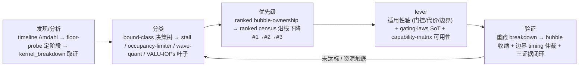

# Bound-class signals (profiler → lever)

> **YOU apply this — there is no rule engine.** This skill ships no classifier and emits no
> `decision.json`: the tables below are discriminators to reason with, not branches a script
> takes on your behalf. The machine forms remain as reference numbers, all in
> `perf_knowledge/hardware/data/` (GEAK repo root; read via
> `kernel_workflow/scripts/kernel_tools/_hwdata.py`): `hw_constants.json` (arch facts),
> `thresholds.json` (calibrated cutoffs, each `basis`-tagged — this page cites their **keys**; the
> current values live only there; its `bound_classification` block is GEAK's one bound ladder —
> ≥ 80 saturated, ≥ 60 bound, 40–60 balanced band, < 40 low — shared with the e2e roofline and
> `kernel_workflow/knowledge/profiling_guide.md`), `workload_models.json` (per-type intensity), `sku.json`
> (peaks / CU / L2 — the single peak source). `lever-cards.json` (levers + gating laws) stays
> next to this file.
>
> Read **relative-first**: rank what you measured by %-of-peak and let the ranking name the
> resource; absolute cutoffs only *confirm* a reading or cover a degraded one. When a cutoff
> disagrees with your measurement the measurement wins — say which cutoff you overrode. Every
> %-of-peak you rank with carries its `numerator_basis` / `denominator_basis`
> (`roofline-models.md ## Every "% of roofline" carries two bases (the reporting contract)`): a
> datasheet-denominator ranking may **order** the stack, it may not close a direction.
>
> This file is the diagnostic reference. The evidence you must have each round, and the tools
> that produce it, are in `../method/profile.md` ("3.1 Required evidence — the four dials, every
> round"); the tool index is `scripts/USAGE.md`.

Maps **rocprofv3 / rocprof-compute / ATT / derived metrics** to a bound class and the
**first backbone layer** to attack. Use after `../method/profile.md`; confirm before
`capability-matrix.md` lever rows. Examples and calibrations are gfx950 (MI355X / MI350X) first;
gfx942 deltas are called out per row and in `cdna3-gfx942.md`.

## Profiler entry and the reading rules this page assumes (GEAK)

- **Entry:** one profiler entry point, GEAK's `kernel_workflow/scripts/profile_kernel.sh`
  (+ `profile_policy.sh`), run **under** `kernel_workflow/scripts/gpu_lock.sh` — no inline
  `HIP_VISIBLE_DEVICES`. The PMC / rocprof-compute / ATT parsers it feeds (`parse_pmc.py`,
  `parse_rc.py`, `kernel_breakdown.py`, `hotspot_analyzer.py`, `att_*.py`) live in
  `kernel_workflow/scripts/kernel_tools/`; the same names under this pack's `scripts/` are shims.
- **Wavefront ratios are fractions of `Total Wave Cycles`, never subtracted from each other.**
  High **Dependency Wait** = a serial dependency chain (latency **C1**) — it is **not** by itself
  memory-bound; high **Issue Wait** = too few resident waves to issue from (latency **C2**,
  occupancy / device fill). C1 and C2 have opposite fixes and tile size moves a kernel between
  them, so re-read the split after every tile / warp change
  (`kernel_workflow/knowledge/profiling_guide.md`, "Splitting latency-bound before choosing a fix").
- **Busy, not duty cycle:** classify a unit by `VALUBusy` / `MfmaUtil` (throughput), not by
  `VALUUtilization` (duty cycle) — `## Rules` below.
- **rocprof-compute version caveats:** `--roof-only` on gfx95x needs rocprof-compute ≥ 3.6.0; on
  gfx950 the `FETCH_SIZE` / `TCC_BUBBLE` read-byte counters under-count, so a gfx950 memory reading
  built on them is cross-checked against `TCC_EA0_*` and the model bytes before it decides a class
  (`roofline-models.md ### When the counter routes disagree`). Counter-slot overflow behaviour
  (replay / abort / hang) is version-dependent and is handled by the safe wrapper's timeout +
  degrade, not by this page.
- GEAK's companion cards for the same reading: `perf_knowledge/profiling/reading_a_kernel_bottleneck.md`,
  `perf_knowledge/profiling/rocprofv3_counters.md`, `perf_knowledge/profiling/rocprof_compute_workflow.md`.

**Role in the three-table split (avoid drift):**
- **`bound-class-signals.md` (this file)** = *judgement*: the decision tree, the
  discriminator leaves, the stall-reason map, and the **lever-applicability single source
  of truth** (gating laws + lever cards).
- **`capability-matrix.md`** = lever *availability* / arch gate (✓ / ◐ / blocked per target).
- **`../method/profile.md`** = the *primary metric* per bound class + how to read a report.

Entry: `atlas.md` table A (profile phase). Counter definitions: `../method/profile.md`
("Derived metrics"). Precise rocprof-compute block IDs:
`## rocprof-compute block-ID cheat-sheet` below.

## Methodology spine (发现 → 分类 → 优先级 → lever → 验证)

The pieces below are not independent lookups — they form one closed loop. Read this
navigation first; it does **not** replace the per-stage cross-check / floor-probe /
three-evidence discipline.



Evidence source per stage is unified by `scripts/kernel_breakdown.py`: dynamic PMC
(rocprofv3 / rocprof-compute) ⊕ static ISA (`asm_loop_audit.py`) ⊕ analytic budget
(`roofline-models.md` feeds-and-speeds), with a degraded (static-only, bubble-inferred)
path when PMC is blind (`../method/profile.md ## Profiler-capability preflight`).

Stage → owner: 发现 = timeline/Amdahl + floor-probe + `kernel_breakdown`; 分类 = the tree
below + its leaves; 优先级 = ranked bubble-ownership → ranked census
(`../method/profile.md`, `../method/climb.md ## Fallback ladder`); lever = `## Lever cards` +
`## Lever gating laws` + `capability-matrix.md`; 验证 = re-run breakdown (bubble shrinks) +
boundary timing + three-evidence (`../method/close.md`).

## Bound-class decision tree (exhaustive, ordered, defaulted)

The discriminator table below is a set of necessary-not-sufficient rows; this tree is the
**exhaustive entry** that guarantees every profile lands in exactly one class, with
**latency/occupancy as the forced residual** when nothing saturates. Read the **busy**
(throughput) counters, NOT the duty-cycle `*Utilization` (see `## Rules`).

```text
read busy (NOT util) →
 1. compute unit saturated? → compute-bound → sub-resource decompose
      MATRIX ENGAGEMENT IS UNIFIED (like NCU SM-throughput = MAX over pipes): matrix-bound iff
        generic MfmaUtil ≥ confirm  OR  scaled-fp8 pipe engaged (MOPS_F8>0 / mfma_by_dtype.fp8_scaled
        on a scaled arch gfx950/CDNA4, where generic MfmaUtil~0). Which counter answers is
        an arch-gated DATA fact (is the scaled-fp8 pipe engaged?) -- NOT a separate branch.
      VALUBusy near peak → compute / valu (sub-decompose)
     1b. VALU active-threads/wave ≪ wave_size OR Branch Util high            → compute / divergence  ← wave-internal predication (NCU Branch-Eff)
     1c. MfmaUtil LOW but occupancy already ADEQUATE (≥2 waves AND not the VGPR/LDS limiter)
         AND the tile is UNDER-FILLED (a long exposed VALU-only run / high full-drain, matrix
         engine starved) → compute / mfma-issue (under-fill)  ← the fix is a BIGGER tile (raise
         arithmetic intensity, accept lower occupancy), NOT occupancy relief. This is the fork out
         of the "low MfmaUtil → latency" trap: only route to latency (node 3) when occupancy is
         INADEQUATE (waves<2 OR a VGPR/LDS limiter). See `## under-fill vs occupancy` below.
 2. else memory saturated / streaming? → memory-bound → SUB-DECOMPOSE (NCU Memory Workload Analysis):
      2a. memory pipe (vmem %-of-peak) ≥ hbm_bw_saturated → memory / bandwidth   (cut bytes; in-flight inert)
      2b. else L2 hit < l2_hit_locality AND coalescing OK → memory / l2-locality (GROUP_SIZE_M / XCD remap)
          [low L2 hit WITH low coalescing = an access-pattern SYMPTOM (grid remap inert) -> generic memory / under-fill]
      2c. else L2-Fabric latency high (per-arch) & not saturated → memory / latency (add in-flight/prefetch)
      2d. else LDS/shared bound (LDSBankConflict / ds_read interval > 16cyc, OR a mixed lds-gmem-feed
          bucket whose lgkmcnt share > vmcnt) → memory / shared  (NCU folds shared-mem under Memory
          Workload); refine: shared-bank-conflict (swizzle) vs shared-issue-rate (~ mio_throttle)
 3. else (nothing saturated) → DEFAULT: latency/occupancy-bound   ← explicit residual ①, force-land here
      → `## Stall-reason → lever` + occupancy limiter (SPI 6.2.x, `../method/profile.md`)
      → sub=ifetch when L1I hit low / fetch-latency high (NCU no_instructions stall)
      → then the `### Residual-① limiter ladder` below
 4. no SOL block leads #2 by > sol_lead_margin (degraded: all inside balanced_band = 40–60 % — was 20–60;
    below 40 on every pipe is node 3, latency) → balanced  ← explicit residual ② (algorithmic / fusion opportunity)
```

> **Canonical `bound_class` vocabulary (use these names when you report one):** `compute` (sub: mfma-issue / valu /
> valu-integer-address / **divergence**) · `memory` (sub: **bandwidth / latency / l2-locality /
> shared** — where **shared** = the LDS sub-resource, refined to **shared-bank-conflict /
> shared-issue-rate**) · `latency` (sub: dependency-stall / issue-limited / over-sync / **ifetch**) ·
> `register` (emitted on hot-loop spill) · `balanced` (residual②). **LDS is no longer a first-branch
> class** — it is `memory / shared` (NCU folds shared memory under Memory Workload Analysis).
> **occupancy** and **wave-quantization** are also NOT separate first-branch classes — they are
> sub-diagnoses + lever groups reached under `latency` (the discriminator rows below refine all of these).
>
> **ARCH SCOPE (evidence is gfx950/CDNA4).** The three memory subs, divergence, and ifetch are
> **universal concepts** (NCU parity), but their thresholds are arch-specific and live in the machine
> layer: HBM-BW-saturation % + L2-hit % (`thresholds.json`, portable cutoffs vs the A-number PEAK in
> `sku.json`), L2-Fabric-latency-high cyc (`hw_constants.arch.<gfx>.l2_fabric_latency_high_cyc`, per-arch
> — gfx950-calibrated only), wave width for divergence (`hw_constants.arch.<gfx>.wave_size`: CDNA=64,
> RDNA/gfx1250=32 — never hardcode 64). The **scaled-fp8 matrix-engagement** term is gfx950/CDNA4
> scaled-path only (folded into node-1's unified matrix test, not a separate branch).
>
> **Basis of the memory %-of-peak.** Node 2a's `vmem %-of-peak ≥ hbm_bw_saturated_pct` is, by
> default, a `counters` numerator over the `sku.json` **datasheet** peak — enough to *classify* and
> rank, not to close. Before a bandwidth verdict closes a direction (or declares "at the HBM
> ceiling"), re-express it over an in-shape probe (`roofline-models.md ## Calibration`); on gfx950
> also confirm the numerator is not the under-counting `FETCH_SIZE` route.

Discipline (systematic without contradicting repo philosophy):
1. **busy, not utilization** — a `VALUUtilization` ~100% with `VALUBusy` **and** `MfmaUtil`
   both low lands in residual ① (latency) — UNLESS occupancy is already adequate (≥2 waves,
   not capped) AND the tile is under-filled, which is node 1c (compute/under-fill, grow the
   tile), NOT latency. This is the repo's edge over a
   naive SOL tree; preserve it.
2. the residual is a **route** (go run floor-probe / stall-reason / occupancy-limiter),
   NOT a substitute for the A/B / floor-probe / cross-check rules.
3. the discriminator table is the tree's **leaves (refine)**. On residual ① the spine
   continues: occupancy limiter (SPI) + stall-reason → then the ranked census picks order.

After classifying, do **not** stop at one class: read the **ranked bubble-ownership stack**
(`scripts/kernel_breakdown.py`; `../method/profile.md ## Bound classification`) to decide
which to attack first; when #1 hits its floor, descend to #2/#3
(`../method/climb.md ## Fallback ladder`).

### Residual-① limiter ladder (ordered by dev-effort × impact)

On latency/occupancy-bound, run this ordered sub-diagnosis (HLRS yAx exercises):

0. **arithmetic-intensity precheck (do this FIRST)** — if `MfmaUtil` is low but occupancy is
   already adequate (≥2 waves AND no VGPR/LDS limiter), the kernel is NOT occupancy-bound: the
   matrix engine is starved by a too-small tile. Do NOT climb the occupancy ladder below — that
   is the wrong axis. Go to node 1c (`compute / under-fill`) and GROW the tile (grow_tile_underfill
   / amortize_parallel_axis), accepting lower occupancy. Only proceed down this ladder when
   occupancy is genuinely INADEQUATE (waves<2 OR a VGPR/LDS limiter). A small-tile kernel at
   adequate occupancy reads as a "VGPR occupancy wall" but is really under-filled — grow the tile.
1. **launch params** (grid/block; rocprof-compute `7.1.x`) — an under-saturated grid →
   `roofline-models.md ## Saturation / wave quantization` (Layer 6). Recognize it when the
   grid has far fewer blocks than CUs; growing the block count (smaller tile / split-K) fixes it.
2. **LDS occupancy limiter** — SPI `6.2.7 Insufficient LDS` + `2.1.15 Wavefront Occupancy`
   (Layer 3/5).
3. **VGPR occupancy limiter** — SPI `6.2.5 Insufficient VGPRs` + `2.1.15` (Layer 5).
4. **strided / uncoalesced access** — poor cache utilization; the culprit when *raising*
   occupancy *lowers* speed. A memory-bound sub-diagnostic (Layer 2 coalescing).

**This ladder is a diagnosis, not a prize.** Relieving the wave-capping resource is right when
occupancy is INADEQUATE; above that point the criterion is one-sided and the measured payoff is
near zero (the CDNA4 measurements are stated once, in `planning-constants.md ## Occupancy is a
one-sided criterion`; `thresholds.json relative.occupancy_useful_pct` is the machine form). Check the units before believing any
limiter reading: `wg/CU` equals `waves/SIMD` only when `num_warps == simd_per_cu`, and the
occupancy input is `ceil8(ceil4(next_free_vgpr))`, not the printed `.vgpr_count`
(`roofline-models.md ### Occupancy is a lever only for latency/memory-bound work`,
`planning-constants.md ### Read the field the hardware reads, and round it before you compare`).

## Discriminator table (gfx950-class) — the tree's leaves

| If dominant signal | Bound class | First layer / lever | Common misread |
| --- | --- | --- | --- |
| MFMA is the top SOL block and cadence ≈ ideal (degraded: `MfmaUtil` ≥ `fallback.mfma_util_compute_pct`) and MFMA% high in ISA | compute / MFMA-issue | Layer 7 — tile shape, MFMA continuity | intensity-only roofline |
| `MfmaUtil` low, small tile / serial epilogue, **occupancy already ≥2 waves & not capped** | compute / under-fill or under-amortized (node 1c) | Layer 7 — grow tile or parallel axis | routing it to latency/occupancy (the low-MfmaUtil trap): if occupancy is adequate the fix is a BIGGER tile, NOT occupancy relief |
| `MfmaUtil` low **but occupancy INADEQUATE** (waves<2 OR VGPR/LDS limiter) | latency / occupancy (node 3) | relieve the wave-capping resource first (`### Residual-① limiter ladder`) | growing the tile here regresses — occupancy is the real cap |
| `VALUBusy` high (throughput) | VALU-bound | Layer 7 — dequant, layout convert, fold scalars; **histogram into compute / layout-convert / register-shuffle / integer-address(IOPs)** (`../method/profile.md`) | `VALUUtilization` alone ≈100% |
| `VALUBusy` high **and** `VALU IOPs` (2.1.1) ≫ `VALU FLOPs` (2.1.0) | VALU / integer-address (instruction-bound) | Layer 5/7 — cut address arithmetic, hoist/coalesce index math, precompute offsets | read as "compute/FLOP-bound" |
| **low-precision weight GEMM (W4A16 / W4A8), `asm_loop_audit` VALU% ≫ MFMA%** | VALU / **software-dequant-bound** (int4/int8 → bf16 unpack dominates, not HBM, not MFMA-continuity) | Layer 7 — cheapen the dequant (native converter if the arch has one; else fold the unpack); **do NOT chase the FLOP/peak MFMA roofline** | "N% of MFMA roofline" — the roofline has no dequant-VALU axis |
| `VALUUtilization` ~100% but `VALUBusy` and `MfmaUtil` both low | dependency-stall | Layer 4/7 — shorten critical path, occupancy | called "VALU-bound" |
| **VALU active-threads/wave ≪ `wave_size` OR `Branch Util` (2.1.12) high** | **compute / divergence** (wave-internal predication; NCU Branch-Efficiency) | Layer 7 — `reduce_divergence`: mask-branch elision / uniform-ize / pow2-align the ragged axis | read as VALU-bound or dep-stall; ARCH: max lanes = `wave_size` (64 CDNA / 32 RDNA) |
| `LDSBankConflict` > `fallback.lds_bank_conflict_pct` (absolute; a trigger to look, never a ceiling) | memory / shared — go to Layer 3 | Layer 3 — swizzle, padding (`layout-recipes.md`) | read as "compute/VALU-bound" |
| `LdsUtil` high or `LDSBankConflict` elevated | memory / shared | Layer 3 — swizzle, padding | |
| `ds_read_b128` interval > `confirm.ds_read_b128_interval_cyc` steady | memory / shared-bank-conflict | Layer 3 — `layout-recipes.md` | |
| **LDS bank-conflict fraction elevated (`SQ_LDS_BANK_CONFLICT/SQ_LDS_IDX_ACTIVE`)** | **memory / shared-bank-conflict** (degraded-mode PMC discriminator when ATT is down) | Layer 3 — swizzle / padding | read as generic LDS/VALU-bound |
| **LDS-ops-per-MFMA high AND bank-conflict low AND sync-removal floor-probe flat** | **memory / shared-issue-rate** (mem-op issue-rate bound ~ NCU `mio_throttle`) | Layer 3 — fewer/wider ds_read per MFMA (generic shared lever) | mistaken for barrier/latency stall |
| **memory pipe (`vmem` %-of-peak) ≥ `hbm_bw_saturated`** | **memory / bandwidth** (NCU Max-Bandwidth) | Layer 2 — `cut_hbm_bytes`: narrow dtype / fuse a streaming pass / reuse (in-flight is INERT) | adding prefetch when already BW-saturated |
| **L2 hit low + pipe NOT saturated + access WELL-COALESCED** | **memory / l2-locality** (NCU L2-hit; a genuine REUSE gap) | Layer 6 — `GROUP_SIZE_M` / XCD PID remap | read as generic memory-bound |
| **L2 hit low but coalescing ALSO low** | NOT l2-locality — the low L2 is a downstream SYMPTOM of the uncoalesced / small-tile access | coalesce the access / grow the tile (grid remap is inert here) | committing to l2-locality and doing XCD remap when the real fix is the access pattern |
| **L2-Fabric latency high (per-arch) + pipe NOT saturated** | **memory / latency** (NCU DRAM/L2 latency) | Layer 4 — `hide_mem_latency`: more outstanding loads / deeper prefetch (occupancy-gated) | confused with bandwidth-bound (opposite lever) |
| `MemUnitStalled` ~0, low MFMA, low VALU busy | latency-bound | Layer 4/5 — occupancy, pipeline depth | |
| **`Instr Cache Hit Rate` low / `Instr Fetch Latency` high** | **latency / ifetch** (NCU no_instructions stall) | Layer 7 — `reduce_icache_pressure`: less unroll / fewer jumps / tighter hot-region code | big unrolled body / short kernel; low-frequency |
| Spill in `.amdgcn` / high scratch; **AGPR use with no MFMA** | register-bound | Layer 5 — slicing | AGPR-without-MFMA = VGPR→AGPR spill smell |
| `tail_efficiency` ≪ 1 and small grid | occupancy / wave-quantization | Layer 6 — tile / split-K / persistent to hit a CU multiple | confused with load-imbalance tail |
| `OccupancyPercent` low, no other dominant | occupancy / latency | Layer 5 — **read SPI limiter (6.2.5 VGPR / 6.2.7 LDS) to pick which to relieve; reconcile with analytic `min(by_LDS,by_regs,by_waves)`** | only if latency/memory class |

> **Low-precision / mixed-precision GEMM — check the op-mix BEFORE the FLOP roofline.**
> For W4A16 / W4A8 / any dequant-in-loop kernel the dominant cost is frequently the
> **software dequant VALU** (int4/int8 → bf16 unpack), which is neither HBM- nor
> MFMA-continuity-bound. The arithmetic-intensity-vs-ridge roofline has **no axis** for
> it, so a "we're at N% of the MFMA roofline" reading misdirects you to an MFMA attack.
> **First run `scripts/asm_loop_audit.py` and compare VALU% vs MFMA%**: if VALU (unpack /
> convert) dominates, the bound class is **VALU / software-dequant** (Layer 7 — cheapen
> the unpack), not MFMA-issue. Only trust the FLOP/peak roofline once the op-mix shows
> MFMA actually dominates (`roofline-models.md`, `../tile-programming/low-precision.md`).

## under-fill vs occupancy (the low-MfmaUtil fork)

A low `MfmaUtil` has **two opposite root causes** that need **opposite fixes** — the classifier's
node 1c vs node 3 split:

- **under-fill (node 1c → compute/mfma-issue)**: occupancy is already ADEQUATE (≥2 waves AND not
  the VGPR/LDS limiter) but the tile is too small, so a long VALU-only run / high full-drain is
  EXPOSED (no MFMA to hide it). Fix = **grow the tile** (`grow_tile_underfill` /
  `amortize_parallel_axis`), raising arithmetic intensity and ACCEPTING lower occupancy. Growing
  the tile here is the win; climbing the occupancy ladder is the wrong axis.
- **occupancy-capped (node 3 → latency)**: occupancy is INADEQUATE — waves<2 OR a VGPR/LDS limiter
  caps resident waves. Fix = relieve the wave-capping resource FIRST (`### Residual-① limiter
  ladder`); a bigger tile only makes the cap worse.

The discriminator is **occupancy adequacy**, not MfmaUtil alone. The failure mode this prevents:
a small-tile kernel that is already at adequate occupancy but starving the matrix engine reads as
a "VGPR occupancy wall" and gets micro-tuned on occupancy levers, when the real fix is a bigger
tile at the SAME occupancy. A one-knob occupancy probe that spills (e.g. forcing more waves/EU →
register spill) does NOT prove an occupancy wall; it proves that ONE crude knob failed. Before
declaring occupancy a wall, try the register-relief levers that cut the wave-capping resource
itself (`reduce_accumulator_traffic` / `tile_slicing` / `lds_dedup`) — a single crude knob's
failure is not evidence the whole dimension is walled.

## Stall-reason → lever (latency/occupancy sub-classification)

Once residual ① (latency/occupancy) is hit, the dominant stall names the root cause. Read
from ATT (`hotspot_analyzer.py`) / Wavefront Runtime Stats / the `asm_loop_audit.py`
`s_waitcnt`/`s_nop` signals (works in degraded mode too). Analogous to Nsight Warp State
Statistics.

| Dominant stall (ATT / wavefront) | AMD meaning | Root cause | Lever |
| --- | --- | --- | --- |
| `s_waitcnt vmcnt` high | waiting on HBM / global | memory latency (≈ long scoreboard) | Layer 2 — async `buffer_load_to_shared`, coalescing, more in-flight |
| `s_waitcnt lgkmcnt` high | waiting on LDS / SMEM | LDS latency / bank conflict (≈ short scoreboard) | Layer 3 — swizzle / padding / fewer rereads |
| **full-drain `lgkmcnt(0)` high + LOWER MfmaUtil at EQUAL VGPR+AGPR & occupancy vs plain** | operand feed staged in front of MFMA every iter (NOT bandwidth: `stalled-on-L2`/`MemUnitStalled` not dominant) | **schedule/overlap gap** (`sub=schedule-overlap`) | The move is the hand-written overlap, in the order `../tile-programming/pipeline.md` defines once: (1) register-level prefetch, (2) an authored LDS ring (gfx950: `async_copy` + `commit_group`/`wait_group`; gfx942 downgrade: sync staging, or 32-bit async with `order=[1,0]`), (3) `warp_pipeline_stage` + scheduling-model choice (`num_warps>=8`) — `../tile-programming/pipeline.md ## Authoring the overlap yourself (the climb default on the Gluon path)` — then pace it (`../tile-programming/instruction-scheduling.md`). Below the parity gate on a Gluon transcription this repays the `lost_pipeline` debt by hand. Re-injecting plain's pipeliner (`reinject_ttgir_pipeliner`, `../tile-programming/pipeline.md ## Reproduce plain's software pipeline on the Gluon path (the parity-recovery route)`) is the **lowest** rung: a below-parity diagnostic that measures the debt, or a last resort when the hand-written ring cannot reach parity; its numbers are labelled `injected`, are never a win, and it is never applied to an incumbent (already-Gluon) kernel. **NOT a ceiling** in any case |
| `s_barrier` high | producer↔consumer sync too dense | over-sync | Layer 4 — relaxed/synced shared-load knob, membar-filter (gate w/ race-test) |
| `s_nop` + high requested stall cycles | exposed fixed-latency hazard (MFMA-write → VALU-read) | hazard not hidden | Layer 5 — more unroll / occupancy (NOT reorder — reorder cannot create slack). Scope: this reads an `s_nop` the **compiler inserted** for a hazard. A small `s_nop` count a *kernel deliberately places* at a stage head is a different thing — a phase lever that shifts one wave's LDS burst off the other wave's 3-source VALU (`../tile-programming/llir-codesign.md ## Phase pacing`) — so check which you are looking at before prescribing unroll |
| Issue Wait / Total dominates **and** MFMA/VALU busy near peak | compute issue-limited | compute | Layer 7 — tile / ILP |
| Issue Wait / Total dominates, MFMA/VALU busy **low** | too few resident waves to issue from (GEAK **C2**) | occupancy / device fill | relieve the wave-capping resource or fill the grid (`### Residual-① limiter ladder`) — the opposite of the C1 fix |
| Dependency Wait / Total dominates (`fallback.dependency_over_active_ratio` vs Active as a confirm) | dependency-chain wait (GEAK **C1**) | serial dependency chain — **not** memory-bound by itself | shorten the critical path (fold scalars off chain, more ILP — often *more* registers per wave); raise occupancy only if the occupancy-gates-latency law says it pays |

## AMD bucket ↔ NCU warp-state mapping (single source)

`metrics.json.warp_state.buckets[].nsight` MUST take a value from this table (enforced by
the canonical bucket enum); free strings like `MIO/LSU` / `ALU dep` / `occupancy` / `Issued` are
**rejected**. An AMD concept with **no** NCU stall analog goes in `warp_state.no_analog[]`, not here.
This is the *judgement* single-source: use these bucket names verbatim so two rounds are comparable.

| AMD bucket (ATT / waitcnt) | canonical `nsight` | NCU meaning | notes |
| --- | --- | --- | --- |
| `waitcnt_unhidden_latency` (vmcnt / HBM+global) | `long_scoreboard` | wait on L1TEX/global data | ✓ direct |
| `lds_gmem_feed` (lgkmcnt / LDS) | `short_scoreboard` | wait on MIO/shared (not L1TEX) | the mixed feed bucket should be split by vmcnt vs lgkmcnt; the LDS half is short_scoreboard, the gmem half long_scoreboard |
| MIO / shared-mem queue pressure | `mio_throttle` | MIO instruction queue full | use only when the queue (not the data wait) is the cause |
| `sync_barrier_nop` (`s_barrier`) | `barrier` | CTA barrier wait | the `s_nop` hazard part maps to `wait`, not barrier |
| `addressing_int` / fixed-latency exec dep | `wait` | fixed-latency execution dependency | NOT "ALU dep" (not an NCU stall name) |
| `not_selected` | `not_selected` | eligible but scheduler picked another | AMD proxy only (see no_analog) |
| `ifetch` (L1I miss / short kernel) | `no_instructions` | no instruction fetched / i-cache miss | latency sub=ifetch |
| oversubscribed math pipe | `math_pipe_throttle` | math pipe throttle | |

**NOT stall reasons (do NOT map into `nsight`):**
- `pipeline_depth_wall` / `register_pressure_*` → these are **occupancy** collapses, and NCU has **no
  "occupancy" warp-stall reason** (occupancy is a separate Section). Put in `no_analog[]` or attribute
  to the NCU Occupancy section, not a stall bucket.
- `HBM-at-ceiling` → this is **SOL Memory% / Memory Workload Analysis** (a throughput fact), NOT the
  `Issued`/`Selected` state (which means the warp *did* issue). Record it in `sol`/`memory`, not a stall.

**`no_analog[]` (AMD has no NCU-equivalent counter):** `Not-Selected vs No-Eligible` — AMD has **no
true eligible-warp counter**, so `occupancy.scheduler_proxy.{issue_limited,latency_limited}` is a
*derived proxy*, never the NCU Scheduler-Statistics eligible-warps-per-cycle truth.

## Lever ↔ NCU provenance

Which `lever-cards.json` levers are standard NCU/NVIDIA optimizations vs AMD-only. Provenance:
**ncu-native** = NCU documents the same lever AND CDNA implements the mechanism (universal);
**ncu-mapped** = the concept maps to a named NCU section/stall but the counter/mechanism is AMD-side;
**amd-specialized** = CDNA/ISA-specific, no clean NCU counterpart (loose analog named). The last column is
the *portable* NCU guidance for the analog — general advice only, no numbers. (Complements the stall-bucket
table above: that maps buckets, this maps levers.)

| Lever | Provenance | NCU analog (section / stall) | Portable NCU guidance |
| --- | --- | --- | --- |
| `coalesce_access` | ncu-native | Memory Workload — uncoalesced access | combine into fewer, wider transactions |
| `wider_buffer_load` | ncu-native | Memory Workload — vectorized access | wider loads = fewer transactions |
| `cut_hbm_bytes` | ncu-native | SOL Memory / Max-Bandwidth | when BW-saturated, only fewer bytes help (in-flight is inert) |
| `raise_occupancy` | ncu-native | Occupancy | higher occupancy hides latency but is not always faster; low occupancy always hurts latency-hiding |
| `lds_dedup` | ncu-native | Occupancy — shared-mem limiter | free the shared-mem/regs resource that caps waves |
| `manual_pipeline_prefetch` | ncu-native | software pipeline / prefetch | prefetch + more in-flight to hide load latency |
| `tile_slicing` | ncu-native | register pressure / spills | cut registers/tile to lift occupancy; kill spills |
| `fold_scalars_valu` | ncu-native | Instruction Statistics (cut work on the binding unit) | reducing ops on a non-binding unit is neutral — cut on the bottleneck |
| `grid_remap_split_k` / `gemm_split_k` / `gemm_block_m_shrink` | ncu-native | Launch Statistics — grid too small | grow the grid to fill the device (wave-quantization) |
| `reduction_structure` / `reuse_shared_operand_load` | ncu-native | algorithmic / register-vs-shared staging | reuse loaded data; balance register vs shared staging |
| `shorten_critical_path` | ncu-mapped | Warp State `wait` | increase active warps / unroll / restructure the dependency chain; lower-latency instr; occupancy first |
| `hide_mem_latency` | ncu-mapped | Warp State `long_scoreboard` | improve locality/coalescing, raise in-flight, stage to shared |
| `swizzle_padding` | ncu-mapped | Memory Workload — shared bank conflict | swizzle/pad the shared layout |
| `reinject_ttgir_pipeliner` | ncu-mapped | software pipeline (Triton-compiler mechanism) | overlap load→compute across iterations. On the Gluon path a diagnostic / last resort only (numbers `injected`, never on an incumbent); the climb default is the authored ring (`manual_pipeline_prefetch`) |
| `reduce_icache_pressure` | ncu-mapped | Warp State `no_instructions` | short kernel / big body — fewer jumps, less unroll |
| `reduce_divergence` | ncu-mapped | Branch Efficiency / predicated-off | uniform-ize control flow; reduce predicated-off lanes |
| `mfma_tile_shape` / `grow_tile_underfill` / `amortize_parallel_axis` | ncu-mapped | Compute Workload — pipe util / Tensor-Core tile | raise work-per-issue; fill the matrix tile |
| `cut_address_arith_iops` | ncu-mapped | integer / ALU pressure | hoist loop-invariant address math out of the hot loop |
| `attn_intra_loop_schedule` | ncu-mapped | scheduling — interleave mem + math | interleave memory ops and math to hide latency |
| `gemm_group_size_m` | ncu-mapped | Memory Workload — L2 hit / threadblock-swizzle | rasterize/traverse tiles for L2 reuse |
| `async_buffer_load_to_shared` | ncu-mapped | `cp.async` (SIMPLE direct-to-shared only) | stage global→shared asynchronously to overlap. **NOT** TMA / `cp.async.bulk` (NV/Hopper-only, no CDNA counterpart) |
| `reduce_accumulator_traffic` | amd-specialized | none (AGPR file is CDNA-only) | — |
| `gemm_xcd_pid_remap` | amd-specialized | loose: TB-swizzle for L2 (XCD is CDNA multi-die) | — |
| `scaled_mfma_lowprec` | amd-specialized | loose: fp8 Tensor Core (mfma_scaled + E8M0 is AMD/OCP-MX) | — |
| `ds_read_tr_transpose` | amd-specialized | loose: `ldmatrix.trans` (LDS transpose intrinsic) | — |
| `downcast_rounding_rtz` / `eliminate_inloop_transpose` | amd-specialized | none (v_perm / pack path is CDNA) | — |

### NV/NCU levers with NO AMD counterpart — do NOT port

NCU documenting an optimization does NOT mean it runs on AMD. These NVIDIA levers are **NV-ISA-only** with
no CDNA equivalent; if NCU material points here, the AMD move is the nearest AMD mechanism OR a
capability-ceiling, never the NV lever (see `capability-matrix.md` arch-gated rows — warp-specialization is
already marked do-not-port there):

- **warp / warpgroup specialization** (producer/consumer) — needs named-barrier warpgroups + cheap dynamic
  register repartition; CDNA has static per-wave allocation → capability-gate, do not port.
- **named-barrier warpgroups** — no CDNA equivalent.
- **TMA / `cp.async.bulk` / tensor-memory (TMEM)** — NV Hopper/Blackwell bulk async DMA; CDNA has only the
  simple `buffer_load_to_shared` / global-load-lds direct-to-LDS async (that simpler form is the AMD analog).
- **`wgmma` async warpgroup MMA** — NV async tensor-core issue; CDNA MFMA is synchronous-issue.
- **dynamic register repartition (`setmaxnreg`)** — CDNA has only the coarse `maxnreg` / `waves_per_eu`.
- **thread-block clusters + distributed shared memory (DSMEM)** — no CDNA equivalent.

## Degraded-mode PMC discriminators (when ATT is unavailable)

When the ATT per-instruction rollup cannot be collected, **first FIX the profiler locus / escalate**
(`../method/profile.md ## Profiler-capability preflight`, `../method/triage.md` — a host-side-over-a-
container-kernel gap is a mis-config to fix, not a blind mode). Only when ATT is genuinely
unavailable, drive the reading from these PMC ratios (the sanctioned FALLBACK,
never a reason to skip ATT):

| PMC ratio | drives | note |
| --- | --- | --- |
| `wait_over_busy` (`SQ_WAIT_ANY/SQ_BUSY`) | primary stall discriminator | high = stall-bound; split latency vs over-sync vs issue-rate by a floor probe (remove barrier/waitcnt; if flat -> issue-rate) |
| `lds_bank_conflict_frac` (`SQ_LDS_BANK_CONFLICT/SQ_LDS_IDX_ACTIVE`) | `memory / shared-bank-conflict` | elevated -> swizzle (XOR16 / padding) |
| `lds_ops_per_mfma` | `memory / shared-issue-rate` | high AND conflict low AND sync-removal floor-probe flat -> mem-op issue-rate bound (~ NCU `mio_throttle`) |

## rocprof-compute block-ID cheat-sheet (when a rocprof-compute report is available)

rocprof-compute is the direct Nsight-Compute analog (one report gives SOL / block-level
SOL / memory chart / roofline / baseline). When available it is the preferred dynamic
source; when absent, fall back to `rocprofv3 --pmc` + static ISA
(`../method/profile.md ## Profiler-capability preflight`). Precise block IDs to pin the tree's nodes:

- **SOL `2.1.x`**: `2.1.0 VALU FLOPs` · `2.1.1 VALU IOPs` · `2.1.8 SALU Util` ·
  `2.1.9 VALU Util` · `2.1.10 MFMA Util` · `2.1.11 VMEM Util` · `2.1.12 Branch Util` ·
  `2.1.14 IPC` · `2.1.15 Wavefront Occupancy` · `2.1.16 LDS BW` · `2.1.17 LDS Bank
  Conflicts/Access` · `2.1.18-21 vL1D/L2 hit + BW` · `2.1.22-25 L2-Fabric BW + latency`.
- **SPI occupancy limiters `6.2.x`**: `6.2.5 Insufficient VGPRs`, `6.2.7 Insufficient LDS`
  (also SGPR / Barrier / Waves rows). Percentages: magnitude ≠ direct occupancy impact,
  but the larger of two nonzero fields limits more (HLRS).
- **per-kernel roofline `4.x`**, **launch params `7.1.x`** (grid/block). The `4.x` roof is an
  `empirical@rocprof-compute-<version>` denominator; on gfx95x it needs `--roof-only` support
  (rocprof-compute ≥ 3.6.0), and on gfx942 / MI325X `roofline.csv` may not be produced at all
  (`cdna3-gfx942.md ## Known tooling issues (gfx942)`). Without it, compute the roofline from
  `roofline-models.md` + measured PMC, labelled with its bases.

Names/IDs are version-sensitive — **probe per build** before trusting (do not hardcode). On gfx950
the memory-chart read bytes from `FETCH_SIZE` / `TCC_BUBBLE` under-count (see the GEAK section at
the top of this page).

## Lever cards (bound-class × applicability)

The "which lever" axis is in `capability-matrix.md`; this is the orthogonal **applicability**
axis — *when it works, what it costs, how to verify*. A rate counter can stay flat while
the kernel speeds up, so **timing at the contract boundary is the keep/revert arbiter; the
counter only localizes** (`../method/profile.md`).

| Bound class / sub-resource | Gate (precondition) | Cost (reg/LDS/occ) | Expected metric move | Boundary sensitivity | Verify |
| --- | --- | --- | --- | --- | --- |
| memory / bandwidth | pipe (`vmem`) ≥ `hbm_bw_saturated` | restructure (narrow dtype / fuse) | achieved bytes ↓ | robust | bytes model + BW vs peak; timing |
| memory / latency | L2-Fabric latency high & NOT saturated | prefetch regs/LDS (tri-lemma) | in-flight ↑, latency bubble ↓ | **eager-exposed** (occupancy-gated) | in-flight vs cap; floor probe; timing |
| memory / l2-locality | L2 hit low & NOT saturated | none | L2 hit ↑ | robust | L2 hit; timing |
| memory / shared (LDS conflict) | conflict > `fallback.lds_bank_conflict_pct` | none | ds_read interval → 16cyc, LDSBankConflict ↓ (rate may stay flat) | robust | cycles ↓ at boundary |
| compute / divergence | active-threads/wave ≪ `wave_size` OR Branch Util high | restructure control flow | active-threads/wave ↑, Branch Util ↓ | robust | active-threads/wave ↑; timing |
| latency / ifetch | L1I hit < `instr_cache_hit_min` | less unroll / fewer jumps | L1I hit ↑ | robust | L1I hit ↑; timing |
| dependency-stall / latency | busy ≪ 100%, util ~100%, **low occupancy** | — | bubble ↓, VALUBusy/MfmaUtil ↑ | **eager-exposed**: pays only at low occupancy | floor probe; boundary timing |
| register / occupancy | wave-capped by VGPR/LDS (SPI) | frees regs/LDS | waves/CU ↑, then bubble ↓ | robust | SPI limiter clears; timing |
| MFMA-issue | MfmaUtil high, tile filled | tile grows regs | MfmaUtil → ~98% | robust | MFMA-eff; timing |
| VALU compute | VALUBusy the bound (A/B confirms) | — | VALUBusy ↓ | robust | A/B removes work → time moves |
| VALU integer/address (IOPs) | `2.1.1` ≫ `2.1.0` | may free regs | IOPs ↓, scalar% ↓ | robust | asm confirms address math gone |
| wave-quantization | small grid, tail_eff ≪ 1 | — | tail_efficiency ↑ | robust | grid ≈ CU multiple; timing |

### Three lever tiers (T0 divergent / T1 universal / T2 convergent)

Levers were historically ranked into three tiers; the tier names are retired (they described a search POLICY, not the kind of work). Kept here only to read older records:

- **T0 — divergent (fan-out).** Cards tagged `search_class: divergent`: mutually-exclusive
  structural/algorithm/dispatch bets whose winner is unknown a priori (split-K, defuse,
  packed-atomic, grow-tile, grid remap, group_size_m). The single-bound census *cannot converge*
  on these — you don't pick one by reading the profile, you **fan out a best-of-N** and let the
  measured target line pick the winner. When >=1 divergent card is **on-bound** (or its coarse
  signal fired, or the reduction router hoisted it), classify sets `decision.requires_prescan` and
  lists them in `prescan_candidates[]`. An *off-bound* divergent card (e.g. `split_k` on a
  compute-bound kernel) is **not** a fan-out direction — it would preempt the targeted fix — and a
  round whose profile pinned a specific sub-resource with an exact convergent lever (e.g.
  the authored-overlap lever for `schedule-overlap`) keeps that targeted lever ahead of a merely
  bound-generic divergent card. When you fan mutually-exclusive structural bets (`../method/climb.md ## Layer Backbone`), take
  EACH arm deep — a structural direction gets a real budget (climb it toward its ceiling), not a shallow screen,
  because its anchor is a regression and the shallow ranking inverts versus the deep one. Compare the
  arms at their deep potential and keep the winner; the deep_engineer's closure self-review (`../method/close.md ## Closure challenge (self-review before a ceiling / keep-baseline / negative close)`) checks whether a
  ceiling-raising bet was left untried.
- **T1 — universal (coarse single-shot).** `tier: universal` cards whose own cheap `coarse_signal`
  fired (below): a self-evident single action, surfaced above the on-bound tier but **not** fanned
  out — there is nothing to compare, you just do it.
- **T2 — convergent (deep-in).** Everything else: the coupled tile ladder (memory → LDS → pipeline
  → slicing → …), advanced one cell at a time under the per-direction iteration budget. This is the
  census's home tier — a single evolving candidate, matured with keep/revert, not a fan-out.

### Universal (coarse) vs fine levers

Most levers are **fine**: they are surfaced only when the round's `bound_class` matches the
card's `applies_to[].bound`, because touching them blind (before the sub-resource is confirmed)
could regress the wrong axis. But a few actions are **self-evident** and should fire on their
OWN cheap signal *regardless of the bound-class label* — `tier: universal` cards carry a
`coarse_signal` to check against already-considered
metrics, and when it fires the lever is promoted to the **top tier**, above the on-bound levers.
This is what stops a mis-classified round from burying the obvious fix in the weak off-bound tier
(a small-tile kernel: grow-tile buried under a latency mis-read; and the LDS-relief stranding).

| Universal card | coarse_signal | fires when |
| --- | --- | --- |
| `grow_tile_underfill` | `tile_underfill` | MfmaUtil low + occupancy not the limiter + a long exposed VALU-only run |
| `eliminate_inloop_transpose` | `dead_transpose` | a layout-convert/transpose VALU share high in the hot loop |
| `downcast_rounding_rtz` | `fp32_cast_present` | an fp32→bf16 cast/convert VALU share in the hot loop |
| `cut_address_arith_iops` | `hot_addr_math` | loop-invariant integer/address IOPs share high |
| `cut_hbm_bytes` | `cuttable_bytes` | HBM pipe near saturation / a bytes-model overage |
| `swizzle_padding` | `bank_conflict` | LDS bank-conflict fraction elevated |

Cutoffs live in `thresholds.json` (`confirm.longest_valu_run_high` / `layout_convert_share_high`
/ `addr_iops_share_high` / `hbm_bw_saturated_pct` / `lds_bank_conflict_frac_high`). A universal
card whose signal does NOT fire falls back to normal on/off-bound tiering (demote-never-exclude);
a card vetoed by `isa_gate` / `default_off` is not promoted even if its signal fires. Everything
else stays **fine** — grows regs / trades occupancy / rewrites structure, so a blind attempt could
regress (e.g. `amortize_parallel_axis`, `mfma_tile_shape`, `tile_slicing`, the pipeline cards).

## Lever gating laws (single source of truth)

Consolidated here so lever selection is not misapplied; the detailed derivations stay in
their source files (back-link only). A lever that is inert in the wrong state:

| Law | When it bites | Source (derivation) |
| --- | --- | --- |
| **Occupancy gates latency-removing levers** — a lever that removes exposed serial-chain latency pays only at low occupancy; on an occupancy-hidden kernel (2+ resident waves) the same change is neutral-to-negative | dependency-stall / latency at low occupancy | defined here (this table is the SoT); machine form `lever-cards.json` gating_laws `occupancy_gates_latency`; `../method/climb.md ## 2. Reversed-intuition traps — read this once` (trap 6) restates it for the reader |
| **overlap / occupancy / ILP tri-lemma** — register-buffered overlap trades against waves/CU | any register-buffered prefetch/overlap | `../tile-programming/slicing.md ## Occupancy budget (P8)` |
| **cutting an idle unit's ops = neutral** — reducing instructions of a unit whose `*Busy` ≪ 100% only shortens slack | any op-count micro-opt on a non-binding unit | `../method/profile.md ## Rule: read the busy/throughput counter` |
| **launch-fusion law** — a launch/host-work reduction is eager-only; inert under a CUDA graph / kernel-only boundary | eager vs graph boundary | `roofline-models.md ## Kernel time decomposition` |
| **resource-cliff retry** — a structurally-sound step that regressed by crossing a VGPR/occupancy cliff gets retried combined with a register-relief layer before being recorded negative | after a regression | `../method/climb.md ## Self-monitoring` |
| **efficacy-before-timing** — verify that the edit LANDED (the lever's expected ISA/counter signal moved) BEFORE reading TFLOPS; a flat timing + an unconfirmed signal means "did my change even take effect?", NOT "the lever is dead". An efficacy-fail is inspected, not recorded as negative | every lever round | you enforce it yourself; `../method/close.md` |
| **per-direction iteration budget (enabling-step hold, unified)** — a big/structural direction matures over many rounds; while iters < budget a standalone neutral/regression is held `provisional-keep`, finalized revert ONLY when the budget is spent (defaults structural ~10 / knob ~2, declared by the run — `thresholds.json` deliberately carries no search-policy budget) AND it has not net-beaten the checkpoint. An enabling step is the special case. | a multi-round structural direction (defuse / grow-tile / packed-atomic / pipeline rebuild) or a declared prerequisite | you track it yourself: name the direction, count its iterations, and hold a neutral step only while it is still maturing; `../method/climb.md ## A direction matures over rounds — do not revert it on round one` |
| **auto-pipeliner interaction (NOT "manual always loses")** — on a DSL with an auto software-pipeliner + a prebuilt-LLVM scheduler (this skill: Route-1 / TTGIR pipeliner), a *frontend* manual interleave can be undone/mis-scheduled by the lower layers, so manual pipelining there often needs Tier-B/LLVM co-design to land; it is not inherently worse. With `dsl.auto_pipeliner` (plain Triton, the front end), first tune the auto-pipeliner (`num_stages`), and PROFILE-verify any manual rewrite (MFMA util / bubble), not wall-time. **On the Gluon path in Triton 3.8.0 there is no auto-pipeliner and no pass consumes `num_stages`** (budget parameter / champion record only): the overlap is authored (`../tile-programming/pipeline.md`), and the stock coexec scheduler strategy — off by default on gfx950/gfx942 (upstream 3.8.0 enables it automatically only on gfx1250); opt in with `TRITON_HIP_USE_COEXEC_SCHEDULER=1` (process-wide, applies at `num_warps <= 4`) or per compile with `llvm_fn_attrs=[["amdgpu-sched-strategy","coexec"]]` (any `num_warps`), accepted on an assembly diff — is the lower layer to try before blaming it (`../tile-programming/compiler-contract.md ## What upstream 3.8.0 actually gives you`) | manual prefetch/interleave on an auto-pipeliner DSL | machine form `lever-cards.json` `dsl_caps.auto_pipeliner`; evidence: a frontend interleave regressed on timing while the SAME family's LLVM-layer interleave won +5% (profile-verified) |
| **reduction-landing is a Layer-0 router, not a counter verdict** — when the op is multi-reduction AND a floor-probe shows a reduction write-out (atomic/RMW/materialize) dominates, the structural router fires and surfaces the Layer-0 decision; classify keeps the SOL bound_class unchanged. The split-vs-fused choice is a floor-probed experiment, and it carries a recompute+scratch tax that can exceed the write-out saved | multi-reduction op whose dominant cost is a reduction write-out | `workload_models.json` `multi_reduction`; `../method/profile.md` |

## Pipeline-breakdown -> lever (ATT ground-truth, per round)

When a decoded ATT dir exists, `scripts/mfma_efficiency.py` (or `scripts/kernel_breakdown.py --att`)
attributes the **cycles between consecutive MFMA** to op-class buckets -- this IS the ground-truth
**ranked bubble-ownership** and supersedes the inferred bubble of the static+PMC breakdown. ATT is
a **per-round VERIFY instrument**, not a one-shot classifier: each round run it, attack the #1
bucket, re-run, confirm THAT bucket shrank (closes the 验证 step of the spine). `scripts/att_opclass.py`
gives the same signal per op-class (active vs stall). Read the buckets against the budget / floor
per the reference-free section below -- qualitative / relative only.

| inter-MFMA bucket (top of the rollup) | reads as | lever |
| --- | --- | --- |
| **WAIT** high (`waitcnt` cycles) | MFMA starved on unhidden memory/LDS latency | Layer 2 async / Layer 3 swizzle / deeper pipeline / raise occupancy (gated below) |
| **SYNC** high (`s_barrier`+`s_nop`) with low WAIT | dense producer/consumer sync in the MFMA stream | on the compiler path this is over-sync -> the compiler-contract manual-interleave / scheduling levers (`../tile-programming/compiler-contract.md`), Layer 4 -- NOT hand-asm ping-pong |
| **addressing (int)** high (IOPs in the gap) | per-iteration index math not hoisted | Layer 5/7 -- hoist / precompute offsets, coalesce index math (ties to the VALU-IOPs row) |
| **lds/gmem feed** high | operand reads on the MFMA critical path | Layer 2/3 -- prefetch depth, conflict-free `ds_read` |
| **softmax / fp-compute** high | the fused epilogue math is the real residue | Layer 7 -- fold scalars off the chain, packed VALU, `exp2`; if already minimal it is the structural floor |
| per-op **MFMA stall/lat** high (`att_opclass`) | MFMA operand-feed starved | same WAIT levers; confirms low `MfmaUtil` |

**MFMA efficiency judge (no peer needed):** compare the median MFMA cadence to the **theoretical
cadence** (fp16/bf16 ~16 cyc, fp8 ~32 cyc; `planning-constants.md`) and to the p10-cadence
self-reference floor. median ~ ideal -> genuine **MFMA-issue-bound** (Layer 7 tile / ILP);
median >> ideal -> **bubble-diluted** (attack the #1 inter-MFMA bucket above).

**Structural-vs-schedulable discriminator (do NOT skip before spending an overlap lever):** a high
WAIT% alone does not license a reorder/interleave lever. Combine three signals --
- WAIT high **and** `deep_mfma_analysis` shows a long single-class run with independent ready ops
  -> **schedulable** (manual interleave / pipeline hint pays);
- WAIT high **but** occupancy ~ 1 wave / no independent work in flight -> **structural /
  occupancy-bound** (add waves or prefetch depth; **reorder is inert** -- it cannot create slack).
Route through the **floor probe** (`../method/profile.md ## Rule: floor probe` -- `full - floor` is
the real overlap headroom) and the **occupancy-gates-latency** law (`## Lever gating laws`).

### Per-round record: rocprof-compute SOL (aggregate) + ATT (per-instruction) -> one ranked stack

Each optimization round assembles ONE record from the three evidence layers and ranks the bubble
owners:
- **aggregate "which block is the ceiling"** -- `kernel_workflow/scripts/kernel_tools/rocprof_compute_probe.sh` (under `gpu_lock.sh`) runs
  rocprof-compute (`profile --no-roof` then `analyze --block 2 3 6`) -> System SOL block %-of-peak
  (MFMA / VALU / VMEM / LDS), the memory chart (vL1D / L2 hit + L2-Fabric latency), and the SPI /
  Workgroup Manager occupancy-limiter (Insufficient VGPR/LDS; empty = not resource-capped). It is
  the Nsight-Compute analog and the richest aggregate source; **degrade to `rocprofv3 --pmc`
  (`parse_pmc.py`)** when it is absent or PMC-blind. Bubble = 100 - MFMA %-of-peak.
- **per-instruction bubble owners** -- the ATT inter-MFMA rollup above (`mfma_efficiency.py`).
- **static schedule** -- `asm_loop_audit.py` (waitcnt quality / s_nop / interleave).

`att/mfma_eff.txt` + `ir/asm_audit.txt` folds all three (+ budget + boundary timing) into `round_<n>/record.json`
(6 groups: config / budget / sol / att / static / decision, incl. the ranked bubble-ownership stack
and `delta_vs_prev`) and emits the must-have figures (bubble decomposition, ranked bottleneck stack,
round trend). The ranked stack is the **priority** input to the census: attack #1, re-profile,
confirm THAT bucket shrank vs the previous round (temporal self-reference). rocprof-compute is
**multi-pass replay** -> run it per round (not per micro-tweak); cost-control by filtering to the
dominant kernel. Numbers live in the record, never in this doc.

## Reference-free ATT reading (no gold / vendor kernel at runtime)

The tools accept an optional peer via `mfma_efficiency --compare`, but the agent must never depend
on one. Generate the reference from the run itself:

1. **Budget IS the reference** -- compare the ATT inter-MFMA attribution to the analytic
   feeds-and-speeds per-resource cycle prediction (`roofline-models.md`): measured WAIT >> the
   predicted `T_lds`/`T_hbm` residual => schedulable / occupancy headroom; measured ~ predicted =>
   at the structural floor, stop.
2. **Floor-probe self-reference** -- `full - floor` (delete the dependent stage) is the
   reference-free "best any overlap could reach"; ATT splits that gap into buckets.
3. **Absolute hardware ceilings** -- bubble = 100 - MfmaUtil; cadence vs 16/32 cyc; any WAIT > 0 =
   unhidden latency; achieved BW vs HBM peak — against the `sku.json` datasheet peak this **ranks**
   only; to gate or close, divide by an in-shape probe (`roofline-models.md ## Calibration`).
4. **Temporal self-baseline** -- the reference is the agent's OWN previous round's ATT (the
   checkpoint); a lever's effect = the targeted bucket's delta vs last round.
5. **Sweep-internal oracle** -- the best point in the agent's own config sweep is a free relative
   reference.
6. **Vendor kernel (aiter / CK / hipBLASLt) = OPTIONAL diagnostic upper-bound only** -- use
   `mfma_efficiency --compare` when one happens to exist to estimate the remaining gap; it is a
   diagnostic cross-check, **NOT the gate** (the gate stays the calibrated roofline / budget —
   `counters` numerator over a probed or `empirical@…` denominator). Absence never
   blocks: fall back to 1-5.
7. **Wall-disproof (before declaring a hardware/compiler IMPOSSIBILITY).** The budget stays the
   perf gate, but a **ceiling / "wall" claim** ("this cannot go faster on this arch" / "needs a
   compiler change") carries a higher bar than a perf comparison. If a reference kernel for the
   same op exists on the **same arch**, first DISPROVE the wall with an ISA instruction-inventory
   diff (`asm_loop_audit.py` / `kernel_breakdown.py --compare`): if the reference reaches the very
   thing claimed impossible (0 spill, the "missing" transpose, the schedule density) using only
   standard ops, the limit is your **formulation**, not the hardware/compiler — re-open the
   formulation, do not record the wall. This does NOT promote the vendor kernel to the perf gate
   (item 6); it is only a disproof instrument for impossibility/Tier-B claims. **"It is JIT-compiled
   so I cannot read it" does not hold**: the machine code is recoverable from the JIT cache without
   running anything (`../method/profile.md ## Reading the machine code of a JIT comparator you
   have no source for`), and the readings it yields — registers, waves per workgroup, load widths,
   in-flight depth — are exactly the instruction-inventory terms this item asks for, with no timing
   and no attribution argument in the path.

## Rules (necessary-not-sufficient)

- **~100% utilization ≠ bound by that unit** — cross-check busy/throughput counters and
  run a controlled A/B (remove work; if time unchanged, stall artifact).
- **Read `VALUBusy`, not `VALUUtilization`** for VALU throughput class.
- **fp8 scaled-MFMA does NOT hit the generic MFMA counter (ARCH gfx950/CDNA4).** On the fp8-scaled
  path `SQ_INSTS_MFMA_generic` / `MfmaUtil` / `mfma_pct` read ~0 even though the matrix engine is
  fully engaged — the work is in `SQ_INSTS_VALU_MFMA_MOPS_F8` (`mfma_by_dtype.fp8_scaled`). This is
  handled by a **UNIFIED matrix-engagement test** (NCU's SM-throughput is itself a MAX over pipes):
  node-1 is matrix-bound iff `mfma_pct ≥ confirm` **OR** the scaled-fp8 pipe is engaged. The
  arch-gated "which counter" question is a DATA question (is the scaled-fp8 pipe engaged?), answered
  before the reading, not inside it --
  it is NOT a special-case branch. This is a scaled-path fact: **gfx942 fp8 is non-scaled and DOES
  hit the generic counter**, so the flag stays off there (probe the counter definition per build
  before extending to a new arch).
- **SALU / scalar-cache (sL1D):** AMD has a scalar unit (`2.1.8 SALU Util`) and a scalar L1D that
  NVIDIA lacks; there is no separate `salu` bound class — a high SALU/scalar-address cost folds into
  `compute / valu-integer-address` (cut/hoist the address math). Note only.
- **Do not conclude "compute/VALU-bound" until the LDS-conflict counter is read.** A high
  `LDSBankConflict` (> `fallback.lds_bank_conflict_pct`) hides behind a high `VALUBusy` — the ISA instruction-count
  audit shows benign `ds_write`/`ds_read` *counts* while the access *pattern* (stride,
  width) is many-way bank-conflicting. An LDS-conflict at this level is a Layer-3 win, not
  a ceiling; it must enter the ranked bottleneck stack (`../method/profile.md`,
  `../method/climb.md`).
- **Roofline intensity** does not pick the binding sub-resource on fused kernels — use
  feeds-and-speeds (`roofline-models.md`) + this table.

## Bound class → capability lookup

| Bound class | `capability-matrix.md` section |
| --- | --- |
| memory / bandwidth | Memory rows — cut bytes / narrow dtype (Layer 2) |
| memory / latency | Memory / async rows — in-flight / prefetch (Layer 2/4) |
| memory / l2-locality | GROUP_SIZE_M / XCD remap (Layer 6) |
| memory / shared (LDS) | LDS / swizzle / `ds_read_tr` rows (Layer 3) |
| pipeline / latency | Pipeline / sched rows (Layer 4) |
| latency / ifetch | reduce unroll / hot-region code footprint (Layer 7) |
| register / occupancy | Slicing / occupancy rows (Layer 5) |
| MFMA-issue | Matrix / `instr_shape` rows (Layer 7) |
| compute / divergence | control-flow / predication (Layer 7); grid-level = LPT remap (Layer 6) |
| VALU / low-precision | Low-precision + matrix rows (Layer 7) |

Then read `atlas.md` table B for the DSL implementation file.

GEAK hardware cards behind the sub-classes (facts only — the judgement stays on this page):
memory / l2-locality → `perf_knowledge/hardware/shared/l2_xcd_swizzle.md` and
`perf_knowledge/optimization/xcd_l2_locality.md`; memory / shared →
`perf_knowledge/hardware/shared/memory_model_lds_bank.md` (gfx950 64 banks first, gfx942 32-bank
downgrade) and `perf_knowledge/optimization/lds_and_bank_conflicts.md`; memory / bandwidth →
`perf_knowledge/hardware/shared/hbm_infinity_fabric.md`; register / occupancy →
`perf_knowledge/hardware/shared/wavefront_simd_vgpr_agpr.md` (its VGPR granule is superseded by
`amd_occupancy.py`, `planning-constants.md ## VGPR / occupancy thresholds (CDNA combined budget)`);
VALU / low-precision and the scaled-fp8 counter caliber →
`perf_knowledge/hardware/cdna4_mi350/matrix_core_blockscale.md`.
